# C-Like Compiler

A compiler for a C-like source language with C++-style extensions,
written in C++17 with Flex and Bison, targeting Three Address Code and
then MIPS.

| | |
|---|---|
| Source language | C-like (a C core plus classes, references and overloading — see the [feature audit](docs/FEATURES.md)) |
| Intermediate representation | Three Address Code: generator, interpreter and optimizer ([`phase3-ir`](phase3-ir/README.md)) |
| Target | MIPS assembly for SPIM / QtSpim ([`phase4-codegen`](phase4-codegen/README.md)) |
| Implementation | C++17, Flex 2.6.4, Bison 3.8.2, g++ 13 |
| Specification | [`docs/project_description.md`](docs/project_description.md) |

## Current development status

> **Current implementation status: every phase works end to end —
> front end, Three Address Code (with an interpreter), the optimizer
> (`-O1`, `-O2`, `-O3`) and MIPS code that runs on SPIM, with register
> allocation.**

```
Front end
├── Preprocessor          ✓  shared/preprocessor        (runs before every phase)
├── Lexical analysis      ✓  phase1-lexer
├── Syntax analysis       ✓  phase2-parser              (LALR(1), AST, parse-time symbol table)
└── Semantic analysis     ✓  phase2b-semantic           (types, scopes, annotated AST)
Back end
├── IR / TAC              ✓  phase3-ir                  (quadruples, backpatching, TAC interpreter)
├── Optimization          ✓  phase3-ir                  (-O1 local, -O2 data-flow, -O3 inlining and loops)
└── MIPS generation       ✓  phase4-codegen             (SPIM; stack frames, run-time library)
```

✓ implemented and tested. Every test program is also compiled with
gcc / g++, and the TAC interpreter and SPIM must print exactly what
that binary prints.

## Compiler architecture



*(Interactive source: [`docs/diagrams/compiler-architecture.html`](docs/diagrams/compiler-architecture.html).)*

```
source.c
   ↓  preprocessFile()            shared/preprocessor   #define, #include, #if; line map kept
preprocessed text
   ↓  yylex()                     phase1-lexer/src/lexer.l   → Lexeme / Token table   (standalone tool)
   ↓  yylex() ⇄ yyparse()         phase2-parser/src/scanner.l + parser.y
tokens → AST (g_astRoot) + parse-time symbol table + Token/Token_Type table
   ↓  sem::SemanticAnalyzer::analyze()   phase2b-semantic/src/*.cpp
annotated AST (types, lvalues, constants, symbols) + sem::SymbolTable + record layouts
   ↓
generate()                    phase3-ir             quadruples per function, labels, frame offsets
   ↓
tac::Program  →  TAC interpreter (--run)
   ↓  mips::generate()            phase4-codegen        one fixed sequence per TAC instruction + run-time library
file.s  →  spim -file file.s
```

The phases are five separate executables that share one static
library, `shared/build/libshared.a`:

| Executable | Input | Output on success | Output on failure |
|---|---|---|---|
| `phase1-lexer/lexer` | a source file | two-column Lexeme / Token table | every lexical error (`Line N: message (near 'x')`) |
| `phase2-parser/syntax_analyzer` | a source file | Token/Token_Type table, AST, symbol table | every syntax error (gcc-style, with caret) + partial AST |
| `phase2b-semantic/semantic_analyzer` | a source file | annotated AST, semantic symbol table, MIPS32 record layouts | every semantic error and warning (gcc-style) |
| `phase3-ir/tac_generator` | a source file | the Three Address Code of every function with its symbol table; `--run` also executes it | the errors of the earlier phases; no code is generated |
| `phase4-codegen/mips_generator` | a source file | MIPS assembly on standard output, run-time library included | the errors of the earlier phases; no code is generated |

Each executable runs all the phases before its own (the later ones
compile phase 2's grammar and the semantic analyzer into their own
build), so each takes a source file directly. The first four also write
a report to `logs/` in the current directory (`logs/<file>.log`, or
`logs/<file>.tac` for the TAC generator).

### Repository layout



```
.
├── README.md                 this file
├── docs/
│   ├── project_description.md    the project specification
│   ├── FEATURES.md               feature audit: matrix and catalog
│   ├── DESIGN_LOG.md             every design decision (D1–D31) with its reason
│   ├── SYMBOL_TABLE.md           both symbol tables in detail
│   ├── examples/                 example programs used in the docs
│   └── diagrams/                 architecture diagrams (HTML + SVG)
├── shared/                   libshared.a — token vocabulary, diagnostics, preprocessor,
│                             AST, type system, symbol tables
├── phase1-lexer/             standalone flex lexer
├── phase2-parser/            flex scanner + bison LALR(1) parser
├── phase2b-semantic/         semantic analyzer
├── phase3-ir/                Three Address Code: generator, interpreter, optimizer, tests
└── phase4-codegen/           MIPS for SPIM / QtSpim: generator, run-time library, tests
```

## Feature matrix

Abridged; the full matrix with test evidence for every row is in
[`docs/FEATURES.md`](docs/FEATURES.md). ✓ implemented and tested,
◐ implemented with documented gaps, — not applicable.

| Feature | Lexer | Parser | Semantic | IR | MIPS | Status |
|---|---|---|---|---|---|---|
| Arithmetic, logical, relational, bitwise, assignment, unary operators | ✓ | ✓ | ✓ | ✓ | ✓ | all phases |
| if-else, for, while, do-while, `until` | ✓ | ✓ | ✓ | ✓ | ✓ | all phases |
| switch/case/default | ✓ | ✓ | ✓ | ✓ | ✓ | all phases |
| goto, labels, break, continue | ✓ | ✓ | ◐ | ✓ | ✓ | jumps over initializations not checked |
| int, char, void, short, long, float, double, bool, unsigned | ✓ | ✓ | ✓ | ✓ | ✓ | all phases |
| Arrays, multi-dimensional arrays | ✓ | ✓ | ✓ | ✓ | ✓ | all phases |
| Pointers, multi-level pointers, pointer arithmetic | ✓ | ✓ | ✓ | ✓ | ✓ | all phases |
| Structures, unnamed structs, anonymous struct members | ✓ | ✓ | ◐ | ✓ | ✓ | no brace elision into struct members |
| Functions, recursion, prototypes, forward calls | ✓ | ✓ | ✓ | ✓ | ✓ | all phases |
| printf / scanf | ✓ | ✓ | ✓ | ✓ | ✓ | all phases (format strings checked) |
| static, extern, const | ✓ | ✓ | ✓ | ✓ | ✓ | all phases |
| Variable arguments (`...`, `va_*`) | ✓ | ✓ | ✓ | ✓ | ✓ | all phases |
| Dynamic memory (`malloc` … `free`) | ✓ | ✓ | ✓ | ✓ | ✓ | all phases |
| Command-line input (`argc`, `argv`) | ✓ | ✓ | ✓ | ✓ | ✓ | all phases |
| typedef, references | ✓ | ✓ | ✓ | ✓ | ✓ | all phases |
| Classes, inheritance, access modifiers | ✓ | ◐ | ◐ | ✓ | ✓ | no constructor initializer lists, `virtual`, `const` methods |
| Constructors/destructors, operator overloading | ✓ | ◐ | ✓ | ✓ | ✓ | no member-initializer lists |
| Function overloading | ✓ | ✓ | ◐ | ✓ | ✓ | converting constructors only in initialization |
| Preprocessor (`#define`, `#include`, `#if`) | ✓ | ✓ | ✓ | — | — | runs before the other phases |

## Implemented basic features

Every basic feature of the specification is implemented and tested in
all phases, down to MIPS: all arithmetic and logical operators, if-else, for,
while, do-while, switch cases, integer and char arrays, pointers,
structures, printf and scanf, function calls with arguments, goto /
break / continue, and the `static` keyword.

## Implemented advanced features

Every advanced feature of the specification is implemented and tested
in all phases: variable-argument functions, dynamic memory
allocation, command-line input, typedef, references, the `until` loop,
multi-level pointers and multi-dimensional arrays. Dynamic memory is
`malloc` / `calloc` / `realloc` / `free`.

Beyond the specification, the code also implements classes and objects,
inheritance, access modifiers, constructors and destructors, operator
and function overloading, a C preprocessor, `extern`, casts,
designated initializers, unnamed structs with anonymous members, and
Itanium C++ name mangling. The semantic analyzer additionally gives gcc-style warnings
for sequence-point violations (`i = i++`), integer overflow in constant
expressions and printf/scanf format mismatches. See
[`docs/FEATURES.md`](docs/FEATURES.md#c-additional-features-discovered-in-the-code).

## Removed features

Four features that an earlier version of the front end supported were
removed on 2026-10-07, before the back end was started, to keep TAC and
MIPS generation focused: **enum and union**, **file manipulation**
(`FILE`, `fopen` …), **lambdas**, and **function pointers**. Their
keywords are no longer reserved and their grammar rules, types and
checks are gone; a program that uses one gets an ordinary error
(`phase2-parser/test/test29_dropped_features.c`,
`phase2b-semantic/test/invalid/e19_dropped_features.c`). The decision
and its consequences are recorded in
[`docs/DESIGN_LOG.md`](docs/DESIGN_LOG.md).

Four more, none of them in the project specification, were removed on
2026-10-10 after a feature audit (decision D31): **`new` / `delete`**
(dynamic memory is `malloc` / `calloc` / `realloc` / `free`),
**`register`**, **`volatile`** and **`long double`**. They are gone
from every phase and are covered by the same two test files.

## Partially implemented

- **Classes**: constructor member-initializer lists (`Dog() : Animal(4) {}`),
  `virtual`, `const` member functions, `friend` and `explicit` are not
  parsed.
- **Struct initialization**: brace elision works for arrays, not for
  struct members.
- **Control-flow analysis**: no flow analysis — "missing return" only
  when a non-`void` function has no `return` at all; no unreachable-code
  diagnostics; `goto`/`case` jumping over an initialization is not
  reported. A read of an uninitialized local is reported as a warning by
  `tac_generator` / `mips_generator` (it needs the flow graph), not by
  `semantic_analyzer`.
- **Phase 1 lexer**: reports line numbers but no columns.

Details: [`docs/FEATURES.md#d-partial-features`](docs/FEATURES.md#d-partial-features).

## Planned

Nothing is in progress: every phase of the agreed plan is implemented.

Not supported and not planned so far: bit-fields, default arguments,
templates, namespaces, exceptions, `inline`, compound literals, nested
functions, wide characters.

## Compiler phases

| Phase | Documentation |
|---|---|
| Shared library (vocabulary, diagnostics, preprocessor, AST, types, symbol tables) | [`shared/README.md`](shared/README.md) |
| Lexical analysis | [`phase1-lexer/README.md`](phase1-lexer/README.md) |
| Syntax analysis | [`phase2-parser/README.md`](phase2-parser/README.md) · grammar walkthrough [`phase2-parser/docs/GRAMMAR_DESIGN.md`](phase2-parser/docs/GRAMMAR_DESIGN.md) |
| Semantic analysis | [`phase2b-semantic/README.md`](phase2b-semantic/README.md) |
| IR / TAC and its interpreter | [`phase3-ir/README.md`](phase3-ir/README.md) |
| Design decisions | [`docs/DESIGN_LOG.md`](docs/DESIGN_LOG.md) |
| Optimization (`-O1`, `-O2`, `-O3`) | [`phase3-ir/README.md`](phase3-ir/README.md) |
| MIPS code generation | [`phase4-codegen/README.md`](phase4-codegen/README.md) |

Each phase folder also keeps its development history in
`docs/DEVELOPMENT_NOTES.md` (not maintained; may be outdated).

## Symbol table

The compiler has two symbol tables — a parse-time scope stack that the
parser and scanner use while parsing, and a persistent, typed scope tree
built by semantic analysis. Both are documented in
[`docs/SYMBOL_TABLE.md`](docs/SYMBOL_TABLE.md).

## Building

Requirements: `g++` with C++17, `flex`, `bison`, `make` (verified with
g++ 13.3, flex 2.6.4, bison 3.8.2 on Ubuntu 24.04). Running the
generated MIPS needs `spim` (`sudo apt install spim`) or QtSpim.

```bash
for p in phase1-lexer phase2-parser phase2b-semantic phase3-ir phase4-codegen; do make -C $p; done
```

Each phase's `makefile` builds `shared/build/libshared.a` first if
needed. `make clean` in a phase removes its own build; `make -C shared clean`
removes the library.

## Running

Front end:

```bash
./phase1-lexer/lexer docs/examples/add.c
```

```bash
./phase2-parser/syntax_analyzer docs/examples/add.c
```

```bash
./phase2b-semantic/semantic_analyzer docs/examples/add.c
```

`semantic_analyzer -q file.c` prints only the verdict and diagnostics.
Exit status is 0 on success (warnings allowed) and 1 on any error.

Three Address Code — print it, or execute it in the interpreter:

```bash
./phase3-ir/tac_generator docs/examples/add.c
```

```bash
./phase3-ir/tac_generator -O2 --run -q docs/examples/add.c
```

```
[exit code 9, 8 instructions executed; 11 without -O2: 27% fewer]
```

With an `-O` flag and `--run` the program is executed twice, optimized
and not, and the two runs must behave the same.

MIPS — generate the assembly and run it in SPIM:

```bash
./phase4-codegen/mips_generator -O2 docs/examples/add.c > add.s
```

```bash
spim -file add.s
```

| Flag | Tool | Meaning |
|---|---|---|
| `-O1` | both | value numbering in each basic block: constant folding, copies, common subexpressions, dead temporaries, jump clean-up |
| `-O2` | both | `-O1` plus constants and copies across blocks and dead assignments (liveness) |
| `-O3` | both | `-O2` plus inlining, tail recursion, global common subexpressions, loop-invariant code motion |
| `--run`, `-q` | `tac_generator` | execute the code; `-q` prints only what the program prints |
| `--stack-only` | `mips_generator` | with an `-O` flag, still keep every value in the stack frame |

Without an `-O` flag the MIPS code keeps every value in the stack
frame, one fixed sequence per TAC instruction. With one, the most used
names live in `$s0`–`$s7` / `$f20`–`$f30`, small constants go into the
instructions, and a peephole pass runs.

Example — a program with a semantic error:

```c
int main() {
    int x = 1;
    int x = 2;
    return y;
}
```

```
Semantic analysis failed: 2 error(s), 0 warning(s) in 'bad.c'.

bad.c:3:9: semantic error: duplicate declaration of 'x' in the same scope (previous declaration at line 2) [redeclaration]
 3 |     int x = 2;
   |         ^

bad.c:4:12: semantic error: undeclared identifier 'y' [undeclared]
 4 |     return y;
   |            ^
```

## Testing

| Suite | Command | Contents |
|---|---|---|
| Lexer | `cd phase1-lexer && ./run.sh` | 9 programs; `test6_lexical_errors.c` must report 11 errors and 1 warning |
| Parser | `cd phase2-parser && ./run.sh` | 36 programs: 24 valid, 12 with deliberate syntax errors (`negative.c`, `test5`, `test14`–`test21`, `test23`, `test29`) |
| Semantic (self-checking) | `cd phase2b-semantic && ./run_tests.sh` | 26 valid + 22 invalid programs with the expected diagnostics written inline (`// error: …`, `// warning: …`, `// mangled: …`), plus the 36 parser programs end to end — **84 checks, all passing** |
| TAC (self-checking) | `cd phase3-ir && ./run_tests.sh` | 30 programs generated and executed by the TAC interpreter, raw and with `-O1`, `-O2`, `-O3`; printed output and exit code must equal `test/expected/*.out` (verified against gcc/g++), plus one check of the generator's own warnings — **31 checks, all passing** |
| MIPS on SPIM (self-checking) | `cd phase4-codegen && ./run_tests.sh` | the same 30 programs compiled to MIPS at `-O0`, `-O1`, `-O2`, `-O3` and run in SPIM against the same expected outputs — **30 checks, all passing** |

`run.sh` scripts print each program's output for inspection; only
`run_tests.sh` checks results automatically (any missing **or**
unexpected diagnostic fails the test, and so does any difference in a
program's output or exit code).

## Known limitations

- `printf` in the SPIM run-time has no `%e`/`%g`.
- The partial features listed above.
- Removed features (see above): `enum`, `union`, file manipulation,
  lambdas, function pointers, `new`/`delete`, `register`, `volatile`,
  `long double`.
- Constructs rejected as syntax errors: bit-fields, default arguments,
  templates, namespaces, `using`, exceptions, `inline`, `virtual`,
  `friend`, `explicit`, `const` member functions, compound literals,
  nested function definitions, `wchar_t` / wide literals.
- `printf`, `scanf`, `malloc`/`calloc`/`realloc`/`free` and `va_*` are
  reserved words of this language (they cannot be used as identifiers);
  `#include <stdio.h>` and other system headers are accepted and ignored.

## Future work

Everything in the agreed plan is implemented. What a next version could
add, in order of value:

1. **Remaining language features** — constructor initializer lists,
   `virtual` functions, brace elision for structs.
2. **Flow analysis in the semantic phase** — a missing `return` on some
   paths, unreachable code, jumps over an initialization.
3. **One driver** that runs every phase and SPIM in a single command.
4. **`printf` `%e` / `%g`** in the MIPS run-time library.
