# Feature Audit

Every status below was established from the source and by running the
current build — not from the specification or older READMEs. Each
feature was compiled through the front-end executables
(`phase1-lexer/lexer`, `phase2-parser/syntax_analyzer`,
`phase2b-semantic/semantic_analyzer`) and, for the IR and MIPS columns,
run in the TAC interpreter and in SPIM; the "Tests" column names test
files that exercise it.

**Legend**

| Mark | Meaning |
|---|---|
| ✓ | implemented in that phase and verified |
| ◐ | implemented with documented gaps (see the notes / [Partial features](#d-partial-features)) |
| ✗ | rejected (not implemented) |
| — | not applicable |

The **IR** column is the Three Address Code generator of `phase3-ir/`
(its tests run the generated code in the TAC interpreter and compare
with gcc/g++ — see [`phase3-ir/README.md`](../phase3-ir/README.md)).
The **MIPS** column is the code generator of `phase4-codegen/` (the same
test programs compiled to MIPS and run in SPIM).
So "all phases" is the strongest status a feature can have.

Test names: `L:` phase1-lexer/test, `P:` phase2-parser/test,
`S:` phase2b-semantic/test (valid `v..`, invalid `e..`).

## Feature matrix

### Basic features (project specification)

| Feature | Lexer | Parser | AST | Semantic | IR | MIPS | Tests | Status |
|---|---|---|---|---|---|---|---|---|
| Arithmetic operators `+ - * / %` | ✓ | ✓ | ✓ | ✓ | ✓ | ✓ | L:test1, P:operators, S:v02 e02 | all phases |
| Logical `&& \|\| !` (short-circuit typing) | ✓ | ✓ | ✓ | ✓ | ✓ | ✓ | L:test1, P:operators, S:v02 | all phases |
| Relational / equality `< > <= >= == !=` | ✓ | ✓ | ✓ | ✓ | ✓ | ✓ | L:test1, S:v02 e02 e06 | all phases |
| Bitwise `& \| ^ ~ << >>` | ✓ | ✓ | ✓ | ✓ | ✓ | ✓ | L:test1, S:v02 e02 | all phases |
| Assignment and compound assignment | ✓ | ✓ | ✓ | ✓ | ✓ | ✓ | S:v02 e02 e20 | all phases |
| Unary `+ - ++ --` (pre/post) | ✓ | ✓ | ✓ | ✓ | ✓ | ✓ | P:operators, S:v02 | all phases |
| Address-of `&`, dereference `*` | ✓ | ✓ | ✓ | ✓ | ✓ | ✓ | S:v06 e06 | all phases |
| if / if-else / nested if | ✓ | ✓ | ✓ | ✓ | ✓ | ✓ | L:test2, P:if_else, S:v08 e08 | all phases |
| for loop | ✓ | ✓ | ✓ | ✓ | ✓ | ✓ | P:loops, S:v08 | all phases |
| while loop | ✓ | ✓ | ✓ | ✓ | ✓ | ✓ | P:loops, S:v08 | all phases |
| do-while loop | ✓ | ✓ | ✓ | ✓ | ✓ | ✓ | P:loops test16, S:v08 | all phases |
| switch / case / default (fall-through, multiple labels) | ✓ | ✓ | ✓ | ✓ | ✓ | ✓ | L:test2, P:test4, S:v08 e08 | all phases |
| break / continue / goto / labels | ✓ | ✓ | ✓ | ◐ | ✓ | ✓ | L:test2, P:test10, S:v08 e08 | all phases; jumps over initializations are not checked |
| int, char, void (+ short, long, long long, float, double, bool, signed/unsigned) | ✓ | ✓ | ✓ | ✓ | ✓ | ✓ | L:test7, S:v01 | all phases (`long double` is rejected) |
| Integer and char arrays | ✓ | ✓ | ✓ | ✓ | ✓ | ✓ | P:array, S:v05 e05 | all phases |
| Pointers | ✓ | ✓ | ✓ | ✓ | ✓ | ✓ | P:pointers, S:v06 e06 | all phases |
| Structures (nested) | ✓ | ✓ | ✓ | ◐ | ✓ | ✓ | P:test2 test11, S:v07 e07 | all phases; no brace elision into struct members |
| printf / scanf | ✓ | ✓ | ✓ | ✓ | ✓ | ✓ | P:printf_scanf, S:v09 e10 v24 e20 | all phases (reserved words; format strings checked) |
| Function declaration / definition / call / arguments / return | ✓ | ✓ | ✓ | ✓ | ✓ | ✓ | P:funcCall test1, S:v04 e04 | all phases |
| static keyword | ✓ | ✓ | ✓ | ✓ | ✓ | ✓ | L:test2, P:test28, S:v01 | all phases |

### Advanced features (project specification)

| Feature | Lexer | Parser | AST | Semantic | IR | MIPS | Tests | Status |
|---|---|---|---|---|---|---|---|---|
| Variable-argument functions (`...`, `va_list`, `va_start`, `va_arg`, `va_end`) | ✓ | ✓ | ✓ | ✓ | ✓ | ✓ | L:test4, S:v04 v18 e15 | all phases |
| Dynamic memory (`malloc` `calloc` `realloc` `free`) | ✓ | ✓ | ✓ | ✓ | ✓ | ✓ | L:test4, P:test6, S:v09 e10 | all phases |
| Command-line input (`int main(int argc, char **argv)`) | ✓ | ✓ | ✓ | ✓ | ✓ | ✓ | S:v12 v13 e11 e12 | all phases (`main` signature checked) |
| typedef | ✓ | ✓ | ✓ | ✓ | ✓ | ✓ | L:test4, S:v01 v07 | all phases |
| References (`int &r`, `int *&r`) | ✓ | ✓ | ✓ | ✓ | ✓ | ✓ | S:v11 v18 e14 | all phases |
| until loop | ✓ | ✓ | ✓ | ✓ | ✓ | ✓ | L:test5, P:test15, S:v08 e08 | all phases |
| Multi-level pointers | ✓ | ✓ | ✓ | ✓ | ✓ | ✓ | L:test3, S:v06 | all phases |
| Multi-dimensional arrays | ✓ | ✓ | ✓ | ✓ | ✓ | ✓ | L:test3, S:v05 e05 | all phases |

### Additional features (not in the specification)

| Feature | Lexer | Parser | AST | Semantic | IR | MIPS | Tests | Status |
|---|---|---|---|---|---|---|---|---|
| Classes, objects, `this`, methods, static members | ✓ | ◐ | ✓ | ◐ | ✓ | ✓ | P:test7 test8 test13, S:v10 e09 | TAC done; front end partial: no constructor initializer lists, `virtual`, `const` methods, `friend`, `explicit` |
| Inheritance (single, multiple), inheritance access | ✓ | ✓ | ✓ | ✓ | ✓ | ✓ | S:v10 e09 e14 | all phases |
| Access modifiers `public` / `protected` / `private` | ✓ | ✓ | ✓ | ✓ | ✓ | ✓ | S:v10 e09 e14 | all phases |
| Constructors / destructors (in-class, out-of-class) | ✓ | ◐ | ✓ | ✓ | ◐ | ◐ | P:test24, S:v17 e15 | TAC done; front end partial: no member-initializer lists |
| Operator overloading (member and free) | ✓ | ✓ | ✓ | ✓ | ✓ | ✓ | P:test24, S:v17 e15 | all phases |
| Function overloading (C++ ranking, ambiguity) | ✓ | ✓ | ✓ | ◐ | ✓ | ✓ | P:test12, S:v11 v16 e04 | all phases; converting constructors only in initialization |
| Preprocessor (`#define` object/function-like, `#` `##` `__VA_ARGS__`, `#undef`, `#if/#ifdef/#ifndef/#elif/#else/#endif`, `#include "…"`, `#error`, `#pragma once`) | ✓ | ✓ | ✓ | ✓ | — | — | L:test11, P:test26, S:v20 e16 e17 | front end complete; `#include <…>` system headers are accepted and ignored |
| `const`, `auto` (type deduction) | ✓ | ✓ | ✓ | ✓ | ✓ | ✓ | S:v01 v11 v18 | all phases |
| `extern` | ✓ | ✓ | ✓ | ✓ | ✓ | ✓ | P:test28, S:v24 e20 | all phases (linkage, composite types) |
| Casts: C-style `(T)e`, functional `T(e)`, `int(x)` | ✓ | ✓ | ✓ | ✓ | ✓ | ✓ | P:test25, S:v19 | all phases |
| `sizeof` (expression and type) | ✓ | ✓ | ✓ | ✓ | ✓ | ✓ | S:v02 v22 v24 | all phases |
| Ternary `?:`, comma operator | ✓ | ✓ | ✓ | ✓ | ✓ | ✓ | S:v02 | all phases |
| Initializer lists, designated `.x = 1`, `[2] = 7`, empty `{}` | ✓ | ✓ | ✓ | ◐ | ✓ | ✓ | P:test24, S:v05 v18 | all phases; brace elision for arrays only |
| Unnamed structs/classes, anonymous struct members | ✓ | ✓ | ✓ | ✓ | ✓ | ✓ | P:test27, S:v22 e18 | all phases |
| Numeric literals: hex, octal, binary, suffixes `U L LL`, floats `.5` `5.` `1e3f` | ✓ | ✓ | ✓ | ✓ | ✓ | ✓ | L:test5 test7 | all phases |
| String/char literals, escapes, adjacent string concatenation | ✓ | ✓ | ✓ | ✓ | ✓ | ✓ | L:test6, P:array | all phases |
| `bool`, `true`, `false` | ✓ | ✓ | ✓ | ✓ | ✓ | ✓ | L:test7, S:v01 | all phases |
| Itanium C++ name mangling | — | ✓ | ✓ | ✓ | ✓ | ✓ | S:v21 | all phases (checked against g++) |

### Compiler capabilities (not language features)

| Capability | Where | Tests |
|---|---|---|
| Preprocessing with a line map (errors reported at the original file and line, including headers) | `shared/preprocessor`, `shared/diagnostics` | P:test26, S:v20 e16 e17 |
| Multiple-error reporting: lexer collects all errors; parser recovers at `;` / `}` (Bison `error` productions); semantic analysis reports every error once (de-duplicated) | `lexer.l`, `parser.y`, `SemanticAnalyzer::error()` | L:test6, P:test14–test21, test23, test29 |
| GCC/Clang-style diagnostics: `file:line:col: kind: message`, source line, caret | `printDiagnostic()` in `shared/diagnostics` | all invalid tests |
| Partial AST on syntax errors (`ErrorNode`) | `parser.y` | P:test5, test14–test21, test23, test29 |
| Token / Token_Type table with context classification (`a → INT`, `f → PROCEDURE`) | `parser.y` + parse-time symbol table | all P tests |
| AST construction during parsing, printed as a tree | `shared/ast` | all P tests |
| Annotated AST: every expression's type, lvalue-ness, folded constant, resolved symbol | `phase2b-semantic/src/report.cpp` | all S valid tests |
| Two symbol tables (parse-time, semantic) with scope paths, unique names, use counts | `shared/symbol_table` | see [SYMBOL_TABLE.md](SYMBOL_TABLE.md) |
| MIPS32 record layouts (size, alignment, field offsets) | `layoutRecord()` in `shared/types` | S:v07 v22 v24 |
| Constant folding in the expression's own type, with overflow / shift / conversion warnings | `foldBinary()`, `wrapToType()` | S:v24 e20 |
| Sequence-point check (`i = i++`) | `phase2b-semantic/src/sequencing.cpp` | S:v02 v24 e20 |
| Forward references: calls to functions defined later, `goto` to later labels | `prescan()`, `hoistFunction()`, `collectLabels()`; parser `resolvePendingReferences()` | P:test10, S:v04 |
| Self-checking semantic test runner (expected diagnostics written inline) | `phase2b-semantic/run_tests.sh` | 84 checks |

## Feature catalog

### A. Basic features — implemented (all phases)

All of the specification's basic features: all arithmetic and logical
operators, if-else, for, while, do-while, switch/case, integer and char
arrays, pointers, structures, printf and scanf, function calls with
arguments, goto/break/continue, `static`.

### B. Advanced features — implemented (all phases)

All of the specification's advanced features: variable-argument
functions, dynamic memory allocation, command-line input, typedef,
references, the `until` loop, multi-level pointers, multi-dimensional
arrays.

### C. Additional features discovered in the code

Classes/objects/`this`, single and multiple inheritance, access
modifiers, constructors/destructors, operator overloading, function
overloading, a C preprocessor, `const`/`auto`,
`extern`, C-style and functional casts, `sizeof`, ternary
and comma operators, designated and empty initializers, unnamed
structs and anonymous struct members, hex/octal/binary literals with
suffixes, `bool`, Itanium name mangling — plus the analysis capabilities
listed above (sequence-point warnings, typed constant folding, record
layouts, gcc-style printf/scanf format checking).

### D. Partial features

| Feature | What is missing | Component |
|---|---|---|
| Classes | constructor member-initializer lists (`Dog() : Animal(4) {}` is a syntax error), `virtual` / polymorphism, `const` member functions, `friend`, `explicit` | grammar (`parser.y`) |
| Struct initialization | brace elision into struct members: `struct { int a[2]; int b; } s = {1, 2, 3};` is rejected (and the message calls `s` an "array variable") | `checkInitializer()` |
| Control-flow checks | no flow analysis in the semantic phase: "missing return" only when a non-`void` function has no `return` at all; no unreachable-code diagnostics; uninitialized reads are warned about by the TAC phase (liveness); a `goto`/`case` jumping over an initialization is not reported | `statements.cpp` |
| Overloading | converting constructors are applied in initialization (`Dog d = 4;`) but not to arguments or returns | `argumentConversion()` |
| Parser member classification | the Token_Type table resolves `p.x` / `p->x` only when the base is a plain identifier (`arr[0].x` stays `IDENTIFIER`); semantic analysis types every form correctly | `parser.y` |
| Phase-1 lexer positions | line numbers only, no columns (the parser's scanner does report columns) | `lexer.l` |

### E. Parser-only features

None of the language features is parser-only: every construct the
grammar accepts is also checked by the semantic analyzer. (The
parse-time symbol table's classifications are cosmetic by design; the
semantic phase redoes all name resolution.)

### F. Planned (not implemented)

| Item | State |
|---|---|
| Three Address Code generation (phase 3) | **done** — [`phase3-ir/README.md`](../phase3-ir/README.md) |
| TAC optimizations | `-O1` (local), `-O2` (global constants/copies, dead assignments) and `-O3` (inlining, tail recursion, global common subexpressions, loop-invariant code motion) **done** |
| MIPS code generation (phase 4) | **done** (SPIM) — [`phase4-codegen/README.md`](../phase4-codegen/README.md) |
| Register allocation (usage counts with live intervals; integer and floating-point registers), immediates, peephole | **done** |

### G. Unsupported (no implementation; rejected as syntax errors)

**Removed on 2026-10-07** (they were implemented in the front end and
then dropped before the back end was started — see
[`DESIGN_LOG.md`](DESIGN_LOG.md), decisions D1–D6): `enum`, `union`
(including anonymous unions), file manipulation (`FILE`, `fopen`,
`fclose`, `fread`, `fwrite`, `fprintf`, `fscanf`, `fgets`, `fputs`,
`feof`), lambdas, and function pointers. Their keywords are ordinary
identifiers again. `enum`/`union` definitions, lambdas and
function-pointer declarators are syntax errors
(P:test29); a function name used as a value, a parameter of function
type and the now-undeclared file names are semantic errors (S:e19);
S:v23 shows the former keywords used as identifiers.

**Removed on 2026-10-10** (decision D31, after a feature audit; none of
them is in the project specification): `new` / `delete` / `delete[]`
(dynamic memory is `malloc` / `calloc` / `realloc` / `free`; a class
object on the heap is set up by an ordinary method, because `malloc`
runs no constructor), the `register` storage class (the register
allocator decides by use count), the `volatile` qualifier (nothing in
this target changes a variable behind the program's back), and
`long double` (it was only another spelling of `double`). The four
words are ordinary identifiers again and each use is a syntax error
(P:test29 [12]–[15]); `long double` is "invalid combination of type
specifiers" (S:e19).

**Never implemented:**

Bit-fields, default arguments, templates, namespaces, `using` aliases,
exceptions (`try`/`catch`/`throw`), `inline`, `virtual`, `friend`,
`explicit`, `const` member functions, compound literals
(`(struct P){1, 2}`), nested function definitions, `wchar_t` and wide
literals (`L'a'`, `L"..."`).
