# Phase 1 — Lexical Analyzer

A standalone Flex scanner that turns a source file into a two-column
**Lexeme / Token** table, or reports every lexical error in the file.

> Status: **implemented and tested**. This executable is the phase-1
> deliverable of the specification. The parser (phase 2) does **not**
> reuse it — it has its own scanner, [`../phase2-parser/src/scanner.l`](../phase2-parser/src/scanner.l),
> built from the same shared token vocabulary.

## Purpose

Recognize the language's lexemes — keywords, identifiers, literals,
operators, punctuation — skip whitespace and comments, and diagnose
malformed input (illegal characters, unterminated or empty literals,
bad escapes, invalid numeric literals), reporting **all** errors in one
run as the specification requires.

## Input

A source file path: `./lexer file.c`. The file is first run through the
shared preprocessor (`openPreprocessed()` from
[`../shared/preprocessor`](../shared/README.md)), so `#define`d names are
expanded, `#include "file"` is inlined and `#if` branches are resolved
before lexing. Each line keeps its line number.

## Output

| Outcome | stdout | stderr | exit |
|---|---|---|---|
| no errors | `Lexeme` / `Token` table (warnings, if any, on stderr) | warnings | 0 |
| errors | — | `Lexical analysis failed: N error(s) …`, then `Line N: message (near 'lexeme')` per error and warning | 1 |

Every run also writes `logs/<file-stem>.log` (created in the current
directory): `No lexical errors found.` or a numbered list of errors.

## Architecture



| File | Contents |
|---|---|
| [`src/lexer.l`](src/lexer.l) | the Flex specification: definitions, rules, and `main()` |
| [`src/token.cpp`](src/token.cpp), [`include/token.h`](include/token.h) | `struct Token { lexeme; type; }`, the `tokens` vector, `addToken()` |
| [`src/logger.cpp`](src/logger.cpp), [`include/logger.h`](include/logger.h) | `writeLexerLog()` — the `logs/` report |
| `../shared/token/token_type.hpp/.cpp` | `enum class TokenType`, `keyword_map`, `operator_map`, `reserved_word()`, `operator_token()`, `to_string()` |
| `../shared/diagnostics/` | `reportDiagnostic()`, `hasErrors()`, `errorDiagnostics()`, `displayLine()` |
| `../shared/preprocessor/` | `openPreprocessed()` |

**Driving model.** `main()` calls `yylex()` **once**. No rule returns a
value; each one calls `addToken()` (or reports a diagnostic) and the
scanner keeps going until end of file. After the single call,
`main()` writes the log, then prints either the error list or the table.

## Data structures

- `std::vector<Token> tokens` — every recognized token, in order
  (`Token { std::string lexeme; TokenType type; }`).
- `enum class TokenType` — the whole vocabulary (103 values): literals,
  type keywords, qualifiers, aggregate keywords, access modifiers,
  storage classes, control-flow keywords, the language's reserved
  library names, and every operator.
- `keyword_map` (65 entries) and `operator_map` — string → `TokenType`.
- The shared `g_diagnostics` vector — every error and warning, with kind
  `Lexical error` / `Lexical warning`.
- Scanner state for literals: `strbuf` (the literal so far),
  `tokStartLine`, `litHadError`, `chrCharCount` (characters in a char
  literal; an escape counts as one).

## Algorithms

Flex compiles the rules into a DFA and applies **longest match, then
first rule**. On top of that:

- **Keywords and identifiers share one rule** (`{ID}`): the matched text
  is looked up with `reserved_word()`; a hit gives the keyword's
  `TokenType`, otherwise `IDENTIFIER`. Adding a keyword is one entry in
  `keyword_map`.
- **Single-character operators share one rule**; `operator_token()`
  picks the `TokenType`. Multi-character operators (`<<=`, `->`, `::`,
  `...`, `++`, …) have explicit rules, and longest match prefers them.
- **Exclusive start conditions** handle text that may run to end of
  file: `COMMENTSTATE` (`/* … */`), `STRSTATE` (strings), `CHRSTATE`
  (character literals). Escape sequences are matched inside both literal
  states, most specific first (`\x41`, `\101`, `\n`; then the malformed
  `\x`, `\8`, `\9`).
- **Positions**: `%option yylineno`; diagnostics carry the line number
  (columns are not tracked in this phase).

## Features

| Category | Recognized |
|---|---|
| Identifiers | `[a-zA-Z_][a-zA-Z0-9_]*` |
| Type keywords | `int char float double void short long signed unsigned bool` |
| Qualifiers, storage classes | `const volatile static typedef auto extern register` |
| Aggregates, OOP | `struct class public private protected this new delete operator` |
| Control flow | `if else for while do until switch case default break continue goto return` |
| Reserved library names (custom to this language) | `printf scanf malloc free calloc realloc va_list va_start va_arg va_end` |
| Other | `sizeof`, `true`, `false` (`BOOL_LITERAL`) |
| Integer literals | decimal, hex `0x1F`, octal `017`, binary `0b101`, suffixes `u`, `l`, `ll` in either order (`10UL`, `10LLU`) |
| Floating literals | `5.5`, `5.`, `.5`, `1e3`, `2.5e-3f` |
| Character / string literals | `'a'`, `'\n'`, `'\x41'`, `'\101'`; `"text\n"`; escapes `\n \t \r \\ \' \" \a \b \f \v \?`, octal, hex |
| Operators | all C operators incl. compound assignments, `->`, `::`, `...`, `?:` |
| Comments, whitespace | `// …`, `/* … */` (multi-line), spaces, tabs, newlines — skipped |

## Error handling

| Input | Diagnostic |
|---|---|
| a character no rule accepts (`@`, `$`, `` ` ``) | `Illegal character` |
| `"text` at end of line or file | `Unterminated string literal` |
| `'a` at end of line or file | `Unterminated character literal` |
| `''` | `Empty character literal` |
| `'ab'` | warning: `Multi-character character constant (has type int)` (accepted, as gcc does) |
| `\q`, `\x` without digits, `\8` | `Invalid escape sequence` |
| `0x` / `0xzz`, `0b` / `0b12`, `089` | `Invalid hex literal …`, `Invalid binary literal …`, `Invalid octal literal …` |
| `/*` never closed | `Unterminated block comment` |

All errors are collected (`reportError()` → `reportDiagnostic()` into
the shared list); lexing continues after each one. The table is printed
only if there are no errors.

A digit followed by letters (`12abc`) is **not** a lexical error: it
lexes as `int_literal 12` then `identifier abc`, and the parser rejects
the sequence. A digit invalid for its base (`089`, `0b12`) is.

## Example

Input ([`../docs/examples/lexer_ok.c`](../docs/examples/lexer_ok.c); output verified with the current build):

```c
#define N 4
int add(int a, int b) {
    return a + b * N; /* sum */
}
```

```
Lexeme                         Token
------                         -----
int                            int
add                            identifier
(                              open_paren_op
int                            int
a                              identifier
,                              comma_op
int                            int
b                              identifier
)                              close_paren_op
{                              open_brace_op
return                         return
a                              identifier
+                              plus_op
b                              identifier
*                              star_op
4                              int_literal
;                              semicolon_op
}                              close_brace_op
```

`N` became `4` (preprocessor) and the comment is gone. An erroneous file
([`../docs/examples/lexer_errors.c`](../docs/examples/lexer_errors.c)):

```c
int main() {
    char c = 'ab';
    int x = 0x;
    int y = 08;
    char *s = "unterminated;
    int z = 3 @ 4;
}
```

```
Lexical analysis failed: 4 error(s) found in 'lexer_errors.c'.
Line 3: Invalid hex literal: expected at least one hex digit after 0x (near '0x')
Line 4: Invalid octal literal: digits 8/9 not allowed after a leading 0 (near '08')
Line 5: Unterminated string literal (near '"unterminated;')
Line 6: Illegal character (near '@')
Line 2: warning: Multi-character character constant (has type int) (near ''ab'')
Lexical errors found.
Report written to logs/lexer_errors.log
```

## Integration

This phase is a standalone tool. Its connection to the rest of the
compiler is the **shared vocabulary**: `TokenType`, `keyword_map` and
`operator_map` in `shared/token` are the same tables phase 2's scanner
uses (its `token_converter.cpp` maps a `TokenType` to a Bison token
code), so a keyword added there is recognized by both phases.

## Building and testing

```bash
make
```

```bash
./run.sh
```

`make` runs `flex` on `src/lexer.l` (→ `lex.yy.c`) and links `./lexer`
with the shared library. `./run.sh` runs the lexer on every file in
`test/`:

| Test | Covers |
|---|---|
| `test1_arithmetic_logical.c` | arithmetic, relational, logical, bitwise, assignment operators |
| `test2_control_flow.c` | if-else, for, while, do-while, switch, goto, break, continue, static, until |
| `test3_arrays_pointers_structs.c` | arrays, multi-dimensional arrays, pointers, structs |
| `test4_functions_advanced.c` | calls, varargs, dynamic memory, argc/argv, typedef, references |
| `test5_until_loop.c` | until, float/hex/char/string constants |
| `test6_lexical_errors.c` | every lexical error kind: **11 errors and 1 warning** |
| `test7_type_modifiers_and_custom_keywords.c` | type modifiers, numeric literal forms, suffixes, booleans, I/O and memory keywords |
| `test9_classes_and_objects.c` | class keywords, access modifiers, `this`, `::` |
| `test11_preprocessor.c` | macros and conditionals expanded before lexing |

`run.sh` only prints results; checking them is manual for this phase.

## Deviations from C

| Behaviour here | In C | Reason |
|---|---|---|
| `printf`, `scanf`, `malloc`, `free`, `calloc`, `realloc` and `va_*` are reserved words | ordinary library identifiers | the language treats I/O, memory and varargs as built-ins, so later phases check them against fixed signatures |
| `until`, `true`, `false`, `bool`, `class`, `this`, `::`, … are reserved | not keywords in C | language extensions |
| `12abc` → two tokens | one malformed preprocessing number | the lexer only recognizes valid token shapes; the parser reports the error |

## Limitations

- No column numbers in this phase's diagnostics.
- Literal values are not decoded (the table shows the source text,
  e.g. `\x41`); decoding happens in the semantic phase.
