# Phase 2 — Syntax Analyzer

A Flex scanner driven by a Bison **LALR(1)** parser. It checks the
grammar, builds the **abstract syntax tree**, maintains the
**parse-time symbol table**, and prints a Token/Token_Type table in
which every identifier is classified from context.

> Status: **implemented and tested**. The parser performs **no semantic
> checks** (no type errors, no undeclared or duplicate identifiers) —
> those are phase 2b, which reuses this grammar and AST.

## Purpose

Decide whether the token stream is a sentence of the language, report
every syntax error it can, and produce the structured representation
(the AST) that semantic analysis consumes.

## Input

A source file path: `./syntax_analyzer file.c`. Like every phase, the
file is preprocessed first (`openPreprocessed()`), then scanned by
[`src/scanner.l`](src/scanner.l) one token at a time, on demand.

## Output

| Outcome | Output | exit |
|---|---|---|
| valid program | `Syntax analysis successful …`, then the **Token / Token_Type** table, the **AST** (`=== Abstract Syntax Tree ===`) and the **symbol table** (`=== Symbol Table ===`) | 0 |
| syntax errors | `Syntax analysis failed: N error(s) …`, each error gcc-style with the source line and a caret (plus `note: insert ';' here` when only one token was possible), then a **partial AST** with `ErrorNode`s | 1 |

A report is written to `logs/<file-stem>.log` either way.

## Architecture



| File | Role |
|---|---|
| [`src/parser.y`](src/parser.y) | the grammar (1,492 lines): 393 rules over 76 nonterminals, precedence declarations, AST-building actions, symbol-table calls |
| [`src/scanner.l`](src/scanner.l) | the scanner Bison calls (`yylex()`), one token per call; decides `TYPE_NAME` vs `IDENTIFIER` (the "lexer hack") and three lookahead tokens |
| [`src/scanner_support.cpp`](src/scanner_support.cpp) | bounded lookahead over the source text (`parenGroupIsExpression()`, `abstractDeclaratorGroup()`, `bracketIsDesignator()`) and declarator-list state (`markDeclaratorList()`, `inDeclaratorListAt()`) |
| [`src/token_converter.cpp`](src/token_converter.cpp) | shared `TokenType` → Bison token code |
| [`src/declarators.cpp`](src/declarators.cpp) | turns a reduced declaration into an AST node and a symbol-table entry: `registerDeclarator()`, `makeTypeExpr()`, `computeTypeStr()`, `makeConstructorNode()`, `makeDestructorNode()` |
| [`include/parser_value.h`](include/parser_value.h) | `ParserValue` — Bison's semantic value type (`%define api.value.type {ParserValue}`), plus `TypeSpec` and `DeclInfo` |
| [`src/main.cpp`](src/main.cpp) | driver: preprocess, `yyparse()`, print or report |
| `../shared/ast`, `../shared/symbol_table`, `../shared/token`, `../shared/diagnostics` | AST nodes and printer, parse-time symbol table and mangling, token log and table printer, diagnostics |

The build (`makefile`) runs `bison -d` on `parser.y` and `flex` on
`scanner.l` into `build/`, and links the result with the shared library.

## Data structures

**Semantic value** (`ParserValue`, one struct for every grammar symbol
instead of a `%union`):

| Member | Used for |
|---|---|
| `str`, `idx` | a token's text and its index in the token log (for line/column) |
| `node`, `nodeList` | the AST built so far |
| `typeSpec` (`TypeSpec`) | declaration specifiers: `parts` (`"UNSIGNED"`, `"INT"`), `tagName`, `typedefName`, `isStatic`, `isExtern`, `isRegister`, `storageClasses`, `isTypedefStorage`, `isConst`, `isVolatile`, `isAuto` |
| `decl` (`DeclInfo`) | a declarator: `name`, `pointerLevel`, `arrayLevel`, `arrayDims`, `ptrOps`, `isReference`, `isFunction`, `isFunctionPointer`, `params`, `isVariadic`, `grouped`, `initExpr`, `ctorInit`, `className` … |
| `paramList`, `bases` | parameter lists, base classes |

**AST** ([`../shared/ast/ast.hpp`](../shared/ast/ast.hpp)): one generic
node type, `ASTNode { kind, label, line, column, children, typeExpr,
access, bases }` plus slots semantic analysis fills (`semType`,
`symbol`, `isLValue`, `constValue`). `ASTKind` has 56 kinds —
declarations (`VarDecl`, `FunctionDef`, `StructDecl`, `ClassDecl`,
`TypedefDecl` …), statements (`IfStmt`, `ForStmt`, `UntilStmt`,
`SwitchStmt`, `CaseStmt`, `GotoStmt` …), expressions (`BinaryExpr`,
`AssignExpr`, `CallExpr`, `MemberExpr`, `IndexExpr`, `CastExpr`,
`NewExpr`, `ConstructExpr` …), literals and `ErrorNode`.
Declarations carry an `ASTTypeExpr` with the full declarator shape
(specifiers, tag, typedef name, pointer operators, array-size
expressions, parameters, `(…)` grouping) so phase 2b can resolve real
types.

**Parse-time symbol table** — a stack of hash maps plus a flat report
log; see [`../docs/SYMBOL_TABLE.md`](../docs/SYMBOL_TABLE.md#part-1--the-parse-time-table).

## Algorithms

- **LALR(1) shift-reduce parsing** (Bison 3.8.2, 711 states). The AST
  and the symbol table are built in the reduction actions — there is no
  separate tree-building pass.
- **Operator precedence and associativity** by `%left` / `%right`
  declarations, lowest to highest: assignment (`=`, `+=` …, right),
  `?:` (right), `||`, `&&`, `|`, `^`, `&`, `== !=`, `< > <= >=`,
  `<< >>`, `+ -`, `* / %`, unary (`- & * ! ~ ++ --`, cast — right),
  postfix (`. -> :: ( [`).
- **Zero conflicts, enforced.** `%expect 0` makes any new conflict a
  build error. The ambiguities the grammar does have are each resolved
  by an explicit precedence: dangling `else` (`IFX` / `ELSE`), the
  "most vexing parse" `T(x);` (declaration wins: `TYPE_NAME`,
  `PREFER_DECLARATION`; expression inside casts and arguments:
  `PREFER_EXPRESSION`), `sizeof (T) * x` (`SIZEOF_TYPE`), and
  `new T * x` (`NEW_TYPE_END`).
- **Lexer hack.** The scanner returns `TYPE_NAME` for a name the
  parse-time table currently knows as a typedef or tag
  (`isTypeName()`), so `T * x;` parses as a declaration. The type-name
  table is scoped, so `int T;` in an inner scope hides an outer type `T`.
- **Bounded lookahead in the scanner** for the few places one token is
  not enough: `FCAST` (a type that starts a functional cast `int(x)`),
  `ABSTRACT_LPAREN` (`(int (*)[3])`, an abstract declarator),
  `DELETE_ARRAY` (`delete[]`).
- **Deferred resolution** of forward references (`goto` to a later
  label, a call before the definition): `queuePendingReference()` /
  `resolvePendingReferences()` fix the Token_Type after the parse.
- **Overload labelling**: a call's AST label becomes the mangled name of
  the overload whose parameter types match the arguments
  (`lookupOverload()`).

## Grammar overview

| Area | Main nonterminals |
|---|---|
| Program | `translation_unit` → `external_decl` (function definitions, declarations, out-of-class constructors/destructors) |
| Declarations | `declaration`, `declaration_specifiers`, `storage_or_type_specifier`, `type_specifier`, `init_declarator_list`, `declarator`, `direct_declarator`, `pointer`, `abstract_declarator`, `initializer`, `initializer_list` |
| Aggregates | `struct_or_class_specifier` (named and unnamed struct/class), `member_decl_list`, `member_item`, `inheritance_opt`, `access_specifier`, `constructor_def`, `destructor_def` |
| Functions | `function_definition`, `parameter_list`, `parameter_decl`, `operator_function_id` |
| Statements | `statement`, `compound_stmt`, `expr_stmt`, `selection_stmt` (if/else, switch), `iteration_stmt` (while, do-while, for, until), `labeled_stmt` (case, default, labels), `jump_stmt` (goto, break, continue, return) |
| Expressions | `expr` (comma), `assignment_expr`, `binary_expr`, `unary_expr`, `postfix_expr`, `primary_expr`, `builtin_call`, `new_type_id` |

A production-by-production walkthrough is in
[`docs/GRAMMAR_DESIGN.md`](docs/GRAMMAR_DESIGN.md).

## Error handling

- `%define parse.error verbose` gives Bison's "unexpected X, expecting Y"
  messages; `yyerror()` records them in the shared diagnostics list with
  the offending token's line and column.
- **Panic-mode recovery** with `error` productions at top level
  (`external_decl`) and in block items (`error ';'`, `error '}'`), and for malformed `do`-`while`,
  so parsing continues and further errors are reported. Each broken
  construct becomes an `ErrorNode` in a partial AST.
- `printDiagnostic()` prints `file:line:col: syntax error: …`, the source
  line, a caret, and `note: insert 'X' here` when exactly one token was
  expected.

Example ([`../docs/examples/parser_errors.c`](../docs/examples/parser_errors.c), verified):

```c
int main() {
    int a = 1
    int b = 2;
    if (a > b {
        a = b;
    }
    return a;
}
```

```
Syntax analysis failed: 2 error(s) found in 'parser_errors.c'.

parser_errors.c:3:5: syntax error: syntax error, unexpected INT, expecting ';'
 3 |     int b = 2;
   |     ^
   | note: insert ';' here

parser_errors.c:4:15: syntax error: syntax error, unexpected '{', expecting ',' or ')'
 4 |     if (a > b {
   |               ^

--- Partial AST (best-effort; each broken construct shows as ErrorNode) ---
Program "translation_unit"
|-- FunctionDef "main : main"
|   `-- CompoundStmt
|       |-- ErrorNode "line 3: near 'int'"
|       `-- ErrorNode "line 4: near '{'"
|-- ErrorNode "line 4: near '{'"
`-- ErrorNode "line 4: near '{'"
```

Recovery is approximate: after the second error the parser resynchronizes
at a `}` and the rest of the function shows up as extra top-level
`ErrorNode`s.

## Example — a valid program

[`../docs/examples/add.c`](../docs/examples/add.c) (verified). Token
classification (excerpt) and AST (excerpt):

```
add                            PROCEDURE
a                              INT
result                         INT
2                              INT_LITERAL
```

```
Program "translation_unit"
|-- VarDecl "global : INT"
|-- FunctionDef "add : _Z3addii"
|   |-- ParamDecl "a : INT"
|   |-- ParamDecl "b : INT"
|   `-- CompoundStmt
|       |-- VarDecl "result : INT"
|       |-- ExprStmt
|       |   `-- AssignExpr "="
|       |       |-- Identifier "result"
|       |       `-- BinaryExpr "+"
|       |           |-- Identifier "a"
|       |           `-- Identifier "b"
|       `-- ReturnStmt
|           `-- Identifier "result"
...
```

The symbol table for this program is shown in
[`../docs/SYMBOL_TABLE.md`](../docs/SYMBOL_TABLE.md#worked-example-real-output).

## Features

Everything in the [feature matrix](../docs/FEATURES.md) is accepted by
this grammar, except the constructs listed as unsupported there. In
particular: all operators with C precedence; if/else, while, do-while,
for (with a declaration), `until`, switch/case/default, goto/labels,
break/continue/return; declarations with pointers, arrays (any number of
dimensions), parenthesized declarators
(`int (*pa)[3]`), references, `const`/`volatile`, `static`/`extern`/
`register`/`typedef`/`auto`; initializer lists with designators;
structs (named or unnamed); classes with inheritance, access
specifiers, constructors/destructors (in or out of class), operator
overloading; `new`/`delete`; C-style and functional casts;
`sizeof`; the built-in I/O, memory and varargs operations.

**Removed** (2026-10-07, see [`../docs/DESIGN_LOG.md`](../docs/DESIGN_LOG.md)):
`enum`, `union`, the file-manipulation built-ins, lambdas and function
pointers. Their tokens and rules are gone, so `enum`, `union`, `FILE`,
`fopen` … and `mutable` scan as ordinary identifiers. A parameter list
after a parenthesized pointer declarator (`int (*fp)(int)`) is rejected
in the `direct_declarator` action with a syntax error;
`test/test29_dropped_features.c` shows every dropped construct being
rejected.

**Not parsed** (syntax errors): constructor member-initializer lists
(`Dog() : Animal(4) {}`), `virtual`, `const` member functions, `friend`,
`explicit`, templates, namespaces, `using`, exceptions, `inline`,
default arguments, bit-fields, compound literals, nested function
definitions, wide literals.

## Integration

- The AST root is the global `g_astRoot` (in the shared library).
  Phase 2b's makefile compiles this same `parser.y` and `scanner.l`
  into its own build, calls `yyparse()`, and — only if there were no
  syntax errors — walks `g_astRoot`.
- The parse-time symbol table is not used by phase 2b's checks; the
  semantic phase rebuilds all name resolution with real types. The
  mangled names agree between the two tables (both use `mangle()`).

## Building and testing

```bash
make
```

```bash
./run.sh
```

`./run.sh` runs the parser over the 36 files in `test/` and prints each
result:

| Kind | Files |
|---|---|
| valid (24) | `array`, `funcCall`, `if_else`, `loops`, `operators`, `pointers`, `printf_scanf`, `test1`–`test4`, `test6`–`test13`, `test24`–`test28` |
| deliberate syntax errors (12) | `negative`, `test5`, `test14`–`test21`, `test23`, `test29` (declarations, control flow, `do`-`while` recovery, functions, arrays/pointers, aggregates, expressions/builtins, cascading recovery, forward references, the dropped features) |

The parser corpus is also run end to end by
`../phase2b-semantic/run_tests.sh`, which checks that the 12 broken files
stop before semantic analysis and the valid ones are accepted.

## Limitations

- No semantic checks (by design).
- Error recovery can produce follow-on `ErrorNode`s after a badly
  broken construct (see the example above).
- The Token/Token_Type table classifies `p.x` / `p->x` only when the
  base is a plain identifier (`arr[0].x` keeps `IDENTIFIER`).
- The constructs listed under "Not parsed".

Development history: [`docs/DEVELOPMENT_NOTES.md`](docs/DEVELOPMENT_NOTES.md) (not maintained).
