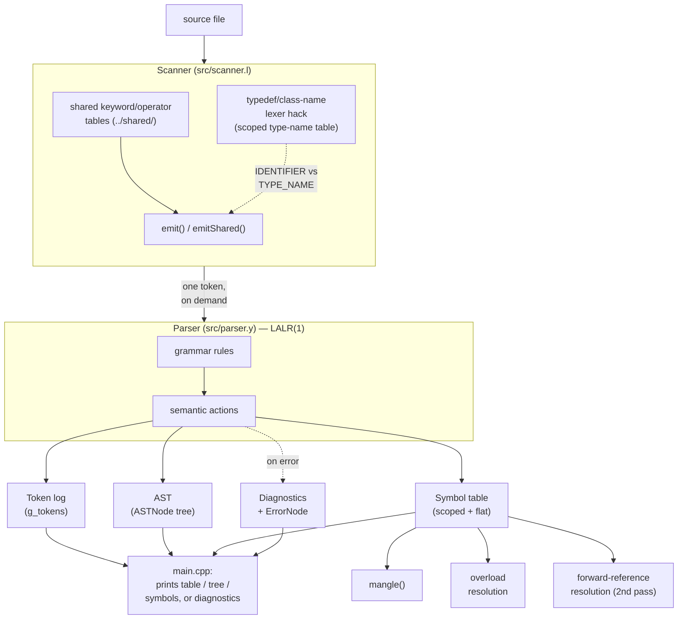
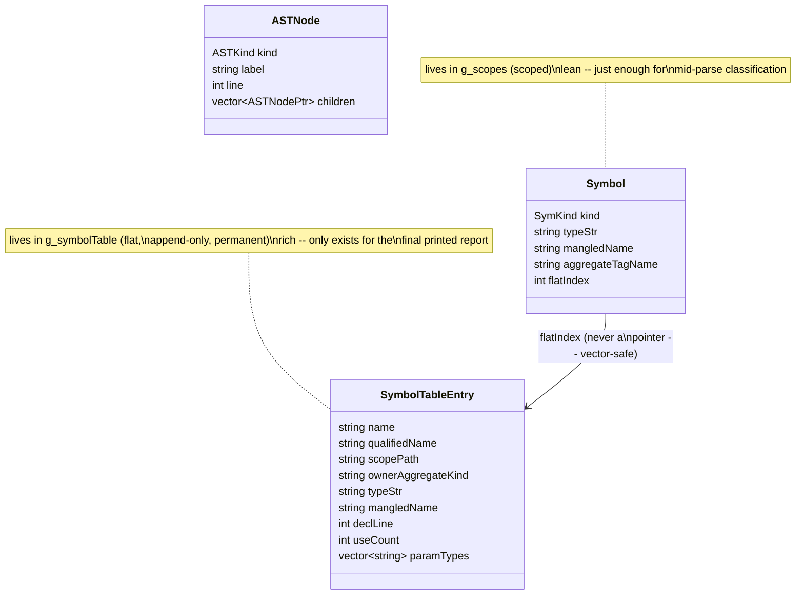

> **Historical development notes — not maintained.**
> This was the phase README until the documentation audit of 2026-10-04.
> It records how the phase was built and the reasoning behind decisions;
> some statements (counts, limitations, plans) are outdated. The current,
> verified documentation is [`../README.md`](../README.md).
>
> In particular, these notes still describe **enum, union, file
> manipulation, lambdas and function pointers**, which were removed from
> the language on 2026-10-07 (see
> [`../../docs/DESIGN_LOG.md`](../../docs/DESIGN_LOG.md), decisions D1–D6).

# Phase 2 — Syntax Analyzer

A Bison/Flex syntax analyzer for the custom C-like language, built on top
of Phase 1's token/keyword design. It consumes source code directly
(scanning + parsing in one pass, feeding tokens to the parser on demand)
and produces either:

- a **Token / Token_Type** table, where every identifier's `Token_Type`
  is its *resolved role* (`INT`, `INT_POINTER`, `PROCEDURE`, `STRUCT`,
  `TYPEDEF`, `LABEL`, `ENUM_CONSTANT`, ...) rather than a blanket
  `identifier`, or
- a list of **every syntax error found**, if the program doesn't parse.

```bash
cd phase2-parser
make                 # builds ./syntax_analyzer
./run.sh             # runs ./syntax_analyzer over every file in test/
./syntax_analyzer test/test1_variables_vs_procedures.c
```

## Architecture at a glance



## At a glance

| | |
|---|---|
| Parsing algorithm | Bottom-up, shift-reduce, **LALR(1)** (via Bison) — not recursive descent |
| Grammar file | `src/parser.y` (~950 lines) |
| Scanner | `src/scanner.l` — driven on demand by Bison, one token per `yylex()` call |
| Semantic value type | One shared `ParserValue` struct (`%define api.value.type`), not a `%union` |
| Outputs on success | Token/Token_Type table, AST, Symbol table |
| Outputs on failure | GCC/Clang-style diagnostics (snippet + caret + fix-it), partial AST |
| Semantic checks performed | **None, deliberately** — no type errors, no redefinition errors, no undeclared-identifier errors (that is [phase 2b](../../phase2b-semantic/README.md)) |
| Grammar conflicts | **0** (`%expect 0`: a new conflict fails the build); originally 7, each now resolved by an explicit precedence -- see [C++ and C99 syntax additions](#c-and-c99-syntax-additions) |
| Test suite | `test/` — 33 files (21 valid, 12 deliberately broken), `run.sh` runs them all |
| Design doc | [`docs/GRAMMAR_DESIGN.md`](GRAMMAR_DESIGN.md) — production-by-production grammar walkthrough |

## Contents

- [Why "smarter" than a plain token dump](#why-smarter-than-a-plain-token-dump)
- [Approach](#approach) — one-pass scanning, the token log, the symbol table, declarator resolution, the typedef lexer hack, scanner sharing, builtin calls, multi-error recovery
- [AST and symbol table](#ast-and-symbol-table-no-semantic-checks) — node design, the two-structure symbol table, mangling, scope paths, struct/class member distinction
- [Grammar coverage](#grammar-coverage) — feature-by-feature status
- [Function overloading](#function-overloading-implemented-not-just-tolerated)
- [Forward references](#forward-references-resolved-a-real-gap-found-and-fixed)
- [Struct/class member access](#structclass-member-access-resolved-a-real-gap-found-and-fixed)
- [Lambda captures](#lambda-captures-resolved-a-real-gap-found-and-fixed)
- [A real inefficiency, found and fixed](#a-real-inefficiency-found-and-fixed)
- [Programmer-friendly diagnostics and a resilient AST](#programmer-friendly-diagnostics-and-a-resilient-ast)
- [Cascading "ghost" errors, improved](#cascading-ghost-errors-improved-a-real-trade-off-tested-and-kept)
- [Known limitations](#known-limitations-by-design-for-a-course-scope-parser)
- [Files](#files)

## Why "smarter" than a plain token dump

The original brief asked for a Lexeme/Token table. That's fine for
*keywords and operators*, but it's not useful for identifiers: printing
`a -> identifier` for every name in the program throws away exactly the
information a syntax analyzer is supposed to recover. Given

```c
int a(int b, int c) { return b + c; }   // a is a function
int main() {
    int a;                              // a *different* a — a variable
    a = 5;
}
```

the two `a`s are the same *lexeme* but play completely different
grammatical roles, and the table should say so. That's what this phase
does: `a` in the first line prints as `PROCEDURE`, `a` inside `main`
prints as `INT`.

## Approach

**1. Bottom-up, shift-reduce, LALR(1) — not recursive descent.** Flex
(`src/scanner.l`) doesn't pre-tokenize the file into a vector the way
Phase 1 does; Bison (`src/parser.y`) calls `yylex()` on demand, driving
an LALR(1) shift-reduce parse of the whole translation unit.

Concretely, that means the parser works from the tokens *up* toward
the start symbol: it shifts tokens onto a stack, and the moment the
top of the stack matches some rule's complete right-hand side, it
*reduces* that span into the rule's left-hand nonterminal — repeatedly,
until everything collapses into a single `translation_unit`. That's
the opposite direction from a hand-written recursive-descent parser
(what Clang and GCC's C++ front-end actually use), which starts at the
grammar's start symbol and works *down*, via ordinary function calls
like `parseIfStatement()` → `parseExpression()` → ... The "LALR" in
LALR(1) is itself a description of a bottom-up algorithm (rightmost
derivation, traced in reverse) — Bison doesn't have a top-down mode to
switch into; generating a bottom-up parser is the entire premise of
the tool.

This distinction isn't just terminology -- it's *why* several real
bugs in this grammar looked and behaved the way they did:

- **Left recursion is mandatory for "list of X" rules, not a style
  choice.** A bottom-up parser can reduce `list: list item` the moment
  it sees one more `item`, keeping the stack shallow and the grammar
  well-behaved. A *top-down* parser calling itself on a left-recursive
  rule would recurse infinitely before consuming a single token --
  which is exactly why hand-written recursive-descent parsers can't
  have left-recursive rules at all without being rewritten first.
  Every "list of X" construct in this grammar is left-recursive on
  purpose:

  | Rule | Shape |
  |---|---|
  | `translation_unit` | `translation_unit external_decl` |
  | `declaration_specifiers` | `declaration_specifiers storage_or_type_specifier` |
  | `init_declarator_list` | `init_declarator_list ',' init_declarator` |
  | `initializer_list` | `initializer_list ',' initializer` |
  | `parameter_list` | `parameter_list ',' parameter_decl` |
  | `argument_list` | `argument_list ',' argument` |
  | `enumerator_list` | `enumerator_list ',' enumerator` |
  | `inheritance_specifier_list` | `inheritance_specifier_list ',' inheritance_specifier` |
  | `member_decl_list` | `member_decl_list member_item` |
  | `block_item_list` | `block_item_list statement` |
  | `type_name_specifiers` | `type_name_specifiers type_name_specifier` |
  | `capture_list` | `capture_list ',' capture` |
  | `postfix_expr` (call/index/member chains) | `postfix_expr '(' ... ')'`, etc. |
  | `pointer` (`char **p`) | `pointer '*'` -- **was** the one accidental exception (below) |

- **Right recursion exists exactly once, deliberately, and is safe for
  a specific reason.** `unary_expr` (prefix `++`, `&`, `*`, `!`, `~`,
  casts, `sizeof`, `delete`) is right-recursive: `'*' unary_expr`,
  `INC unary_expr`, and so on. That's *correct* here, not an oversight
  -- prefix operators genuinely need their operand to come after them,
  and there's no rule like `unary_expr: '*'` standing alone as a
  competing "stop here" reduction, so there's no ambiguity for the
  parser to resolve incorrectly. Right recursion is only dangerous
  when a shorter, complete alternative competes with the "keep
  recursing" path for the same lookahead token.
- **`pointer` was originally written right-recursive
  (`pointer: '*' | '*' pointer`) by exactly the same intuitive
  reasoning that makes `unary_expr` correct -- and it broke, because
  unlike `unary_expr`, `pointer: '*'` *is* a complete, standalone
  alternative.** That gave the parser a genuine competing choice at
  every additional `*`: reduce now, or shift and keep going. Because
  `pointer` is *also* reused in an unrelated context (`type_name`, for
  casts/`sizeof`/`new`) that legitimately competes with `binary_expr`'s
  own use of `*`, LALR's state-merging let that unrelated context's
  precedence resolution silently apply to plain pointer declarators
  too -- and `char **p;`/`char **argv` failed to parse as a result.
  Rewriting it left-recursive (`pointer: pointer '*'`) was the fix,
  and it's the *general* fix for this entire class of problem, not a
  one-off patch: always write repetition as left recursion, because
  right recursion's failure modes depend on which other, unrelated
  parts of a large grammar happen to share a nonterminal -- something
  you can't reliably predict just by reading the rule in isolation.

**2. A token log, patched after the fact.** Every token the scanner
matches is appended, in order, to a global vector of `{lexeme,
category}` (`g_tokens`, `../shared/token/token_log.hpp`). Identifiers start with a
generic placeholder category. Each token carries the *index* of its
own slot in that vector inside the parser's semantic value
(`ParserValue::idx`). As the grammar reduces a declaration, a function
header, a struct tag, a label, etc., the corresponding semantic action
looks up (or inserts) the identifier in the **symbol table** and calls
`setCategory(idx, resolvedType)` to overwrite that specific slot. At
the end, if there were no errors, the log is printed as the final
table — in original token order, but with every identifier now
carrying its resolved role instead of the word "identifier".

**3. A scoped symbol table.** `../shared/symbol_table/` (part 1)
keep a stack of scopes (`vector<unordered_map<string, Symbol>>`). A
new scope is pushed on every `{`, on entry to a function body (before
its parameters are inserted, so they're visible for the whole body),
and on a `for (int i = ...; ...)` init-declaration; it's popped on the
matching `}`. Symbols carry a `SymKind` (`VARIABLE`, `PROCEDURE`,
`PARAMETER`, `STRUCT_TAG`, `CLASS_TAG`, `ENUM_TAG`, `UNION_TAG`,
`TYPEDEF_NAME`, `ENUM_CONST`, `LABEL`) and the pre-computed string to
print for it. Lookup walks the scope stack from innermost to outermost,
so shadowing works the same way it does in C.

**4. Declarator → type-string resolution.** `declaration_specifiers`
accumulates the base type (`INT`, `UNSIGNED_LONG`, `STRUCT`, ...) into
a small `TypeSpec` struct; `declarator` accumulates pointer depth
(`*`/`&`) and array depth (`[...]`) into a `DeclInfo` struct.
`registerDeclarator()` combines the two into the final classification
string, e.g. `int **p` → `INT_POINTER`, `char name[20]` →
`CHAR_ARRAY`. If the declarator turns out to have a parameter list
(`name(...)`), it's registered as `PROCEDURE` instead, and if the
declaration was prefixed with `typedef`, the name is registered as
`TYPEDEF` and remembered so the *scanner* can recognize later uses of
it as a type name (see next point).

**5. The typedef "lexer hack".** `MyInt x;` is genuinely ambiguous to
an LALR(1) C-style grammar unless the scanner and parser cooperate:
when the parser finishes a `typedef` declaration it adds the new name
to a table of type names; the scanner checks every identifier it
matches against that table and returns a distinct `TYPE_NAME` token
(instead of `IDENTIFIER`) for known typedef names. That one-token
difference is what lets the grammar treat `MyInt` as a type-specifier
without any backtracking or ambiguity — this is the same technique real
C compilers built with yacc/bison use.

*Amendment:* the table started out as one global set, so a struct
defined inside a function stayed a type name for the rest of the file,
and an inner `int T;` could not hide an outer typedef `T`. It is now
scoped exactly like the symbol table (`addTypeName` / `hideTypeName` /
`isTypeName`, pushed and popped with `pushScope`/`popScope`). Right after
a type keyword (`int`, `char`, ...) the scanner also returns a typedef'd
name as `IDENTIFIER` (`g_afterTypeKeyword`), because a declaration
cannot have two types — so `int T;`, `char *T;` and `typedef char T;`
redeclare `T` instead of failing to parse. Inside a class body the
class's own name is a type too (`Node *next;`), except directly before
`(`, where it names a constructor.

**6. Custom keywords are parsed as builtin calls, not identifier
calls.** Per Phase 1's design, `printf`, `scanf`, `malloc`, `free`,
`calloc`, `realloc`, and the whole `fopen`/`fclose`/`fread`/`fwrite`/
`fprintf`/`fscanf`/`fgets`/`fputs`/`feof` family are *reserved
keywords* in this language (real C treats them as ordinary library
identifiers). The grammar has a dedicated `builtin_call` production
for each of them so they parse as calls without needing a symbol-table
entry.

**7. Multiple syntax errors, not just the first.** `%define
parse.error verbose` gives descriptive messages ("unexpected X,
expecting Y"). Panic-mode recovery rules (`statement: error ';'` and
`external_decl: error ';' | error '}'`, each followed by `yyerrok;`)
let the parser discard tokens up to the next statement/declaration
boundary and keep going instead of aborting on the first mistake, so a
file with several unrelated mistakes gets several diagnostics in one
run (see `test5_syntax_errors.c`). Every diagnostic (line, the text
near the error, and the message) is collected in `g_diagnostics` and
also written to `logs/<file>.log`. On success, the log file contains
the same three sections stdout does -- Token/Token_Type table,
Abstract Syntax Tree, Symbol Table -- via shared print functions in
`main.cpp` so the two outputs can't drift apart from each other.

## AST and symbol table (no semantic checks)

On top of the classified token table, this phase now also builds a
real **abstract syntax tree** and a **symbol table with name
mangling** -- while deliberately staying out of semantic-analysis
territory (no type checking, no redefinition errors, no "undeclared
identifier" errors). Per the standard compiler-phase breakdown, syntax
analysis's job is tokens in, (parse tree / AST + syntax errors) out --
semantic checking and an *annotated* AST are the next phase's job, not
this one's.



One generic `ASTNode` shape represents every construct in the tree
(no class hierarchy per statement/expression kind); two *separate*
structs represent a symbol, on purpose, each carrying only what its
own job actually needs -- both explained in full below.

```
$ ./syntax_analyzer test/test1_variables_vs_procedures.c
...
=== Abstract Syntax Tree ===
Program "translation_unit"
|-- FunctionDef "a : _Z1aii"
|   |-- ParamDecl "b : INT"
|   |-- ParamDecl "c : INT"
|   `-- CompoundStmt
|       `-- ReturnStmt
|           `-- BinaryExpr "+"
|               |-- Identifier "b"
|               `-- Identifier "c"
...

=== Symbol Table ===
Name                 Kind           Line   Scope                        Type             Qualifiers               Uses      Signature              Mangled Name
----                 ----           ----   -----                        ----             ----------               ----      ---------              ------------
a                    procedure      9      global                       PROCEDURE                                 0         INT (INT, INT)         _Z1aii
b                    parameter      9      global > a()                 INT                                       1
c                    parameter      9      global > a()                 INT                                       1
main                 procedure      13     global                       PROCEDURE                                 0         INT ()                 _Z4mainv
a                    variable       14     global > main()              INT                                       2
result               variable       16     global > main()              INT                                       0
```

**AST.** One generic node shape (`ASTKind kind; std::string label;
vector<ASTNodePtr> children;` in `include/ast.h`) is enough to
represent the whole tree without a class hierarchy per construct --
this is a syntax tree for display/verification, not a typed IR a
later phase compiles against. Every grammar rule that has structural
meaning (declarations, statements, expressions) builds and returns
its own node via a new `node` field on `ParserValue`; container rules
(`block_item_list`, `argument_list`, `member_decl_list`, ...)
accumulate into a `nodeList` field the same way `paramList` already
worked for declarators. `printAST()` renders it with ASCII branch
connectors (`|--`, `` `-- ``), one node per line.

Two things worth flagging about how it's built:
- **Redundant parens are dropped.** `'(' expr ')'` just returns the
  inner expression's node rather than wrapping it, so `(a + b)` and
  `a + b` produce the identical subtree -- parenthesization is a
  parsing aid, not something worth a tree node.
- **Omitted optional parts are simply absent, not shown as an
  explicit "none".** An `if` with no `else`, or a `for`-loop with no
  increment expression, prints with fewer children rather than an
  empty placeholder node. `mkNode()`'s children list silently skips
  any `nullptr` passed to it, which is what makes this automatic
  without every call site having to check first.

**Symbol table.** `pushScope()`/`popScope()` (used during parsing for
correct, shadow-respecting name lookup) discard each scope once it's
popped, so there'd be nothing left to print at the end. A second,
append-only `g_symbolTable` (`../shared/symbol_table/`) records every
`declareSymbol()` call permanently, independent of scope lifetime,
purely for this final report -- it plays no role in parsing itself.
Class members are recorded with a qualified `ClassName::member` name
using a single-slot "current class" tracked via `enterClass()`/
`leaveClass()`, entered right after a class/struct/union tag is
declared and left once its closing `}` is reached.

Concretely, that's **two different structs** carrying different
subsets of the same information, on purpose:
```cpp
struct Symbol {                          // lives inside g_scopes, for lookup
    SymKind kind;
    std::string typeStr;
    std::string mangledName;
    int flatIndex = -1;                  // this symbol's slot in g_symbolTable
};

struct SymbolTableEntry {                // lives in g_symbolTable, for reporting
    std::string name, qualifiedName, typeStr, mangledName, scopePath, ...;
    int declLine; bool isStatic, isConst, isVolatile; int useCount; ...
};
```
`Symbol` stays deliberately lean -- it's only ever consulted mid-parse
to classify a token or resolve a type, so it carries just enough to do
that. `SymbolTableEntry` carries everything else (declaration line,
qualifiers, usage count, ...), since it only exists for the final
report and there's no cost to it being bigger. `flatIndex` is the
bridge between them: an **index**, not a pointer, specifically because
`g_symbolTable` is a `std::vector` that can reallocate as it grows --
storing a raw pointer into it anywhere would be a live dangling-pointer
bug waiting for the vector to resize. An index stays valid across any
number of reallocations, so `recordUsage()` can cheaply bump a usage
count in the flat table (`g_symbolTable[s->flatIndex].useCount++`)
from a `Symbol*` obtained during parsing, without either struct
needing to know more about the other than it has to.

Beyond name/kind/type, each entry also carries what a real compiler's
symbol table typically accumulates before code generation, all still
purely structural (nothing here validates or flags anything):

- **Declaration line.** `TokenRecord` now stamps every token with the
  line it was scanned on; a declarator's `nameIdx` is looked back up
  through `g_tokens` for an accurate line even when the declaring
  action doesn't fire until several tokens later (e.g. after a long
  initializer expression has already advanced the scanner).
- **Scope, as a readable owner path rather than a bare number.**
  Every `pushScope()` call now takes a label describing what the scope
  actually *is* -- `"main()"`, `"class Dog"`, `"Dog::Dog()"`,
  `"switch"`, `"for"` -- and `currentScopePath()` joins every
  currently-open scope's label in nesting order
  (`"global > main() > for"`), captured once per symbol at declaration
  time into `SymbolTableEntry::scopePath`. Function bodies,
  constructors/destructors, struct/union/class bodies, lambdas, and a
  `for`-loop's own init-scope all get a specific label taken straight
  from context already available at that point in the grammar (the
  declarator's name, the enclosing class, etc.) -- no renumbering
  needed, since the label is just one more line inside an action block
  that already existed.

  `if`/`while`/`do`/`until` bodies are the one place this stops short
  and falls back to a generic `"block"` label instead of `"if"`/
  `"while"`/etc, and that's a deliberate, tested decision, not an
  oversight: those all route their body through the same generic
  `statement` nonterminal that also handles the dangling-else case,
  and inserting a mid-rule action there to hint the label turned out
  to badly break the `%prec IFX`/`ELSE` precedence mechanism the
  dangling-else fix depends on -- conflict count jumped from the usual
  7 to 78, and the rule became unreachable. Reverted immediately, and
  left alone rather than risk reintroducing exactly the class of
  silent grammar bug the pointer-recursion issue earlier in this
  project already was. `switch`, structurally unrelated to that
  precedence machinery, got the same treatment and *is* safe (tested:
  conflict count stayed at 7), so its body correctly shows `"switch"`.
- **Struct members vs. class members vs. union members, distinguished
  in the Kind column** (`struct_member`, `class_member`,
  `union_member`, `struct_method`, `class_method`, ...), not just
  inferable from reading the qualified name or scope path text. This
  needed a real correctness fix along the way: `enterClass()` (renamed
  in spirit, kept the name for minimal churn) already bracketed an
  entire aggregate body including every member function's own `{...}`
  -- so naively stamping every `declareSymbol()` call with "whatever
  aggregate is currently open" would have wrongly tagged a plain local
  variable *inside* a method as a struct/class member too. Fixed with
  `markAggregateMemberDepth()`, called immediately after the
  aggregate's own scope is pushed: only symbols declared at *exactly*
  that scope depth (the fields and methods directly in the body) get
  stamped; anything declared one level deeper (a method's own
  parameters or locals) correctly doesn't. Verified with a struct
  containing a method with its own local variable, confirming the
  local stays a plain `variable` while the field and method
  themselves correctly show `struct_member`/`struct_method`.
- **Storage class and qualifiers** (`static`, `const`, `volatile`) --
  previously parsed and silently discarded; `TypeSpec` now actually
  carries `isConst`/`isVolatile` alongside the `isStatic` it already
  had, and they ride along into the symbol table entry.
- **Pointer/array depth as plain numbers**, not just baked into the
  `INT_POINTER`/`INT_ARRAY`-style type string.
- **A real return type and readable parameter list for functions**,
  shown as `Signature` (e.g. `INT (INT, INT)`) -- separate from the
  generic `PROCEDURE`/`CONSTRUCTOR`/`DESTRUCTOR` kind label and
  distinct from (but consistent with) the encoded mangled name.
- **A usage count.** `recordUsage()` bumps a counter on every *use* of
  a name (an identifier in an expression, a `goto`'s target label) as
  distinct from every *declaration* of one. It has two overloads --
  `recordUsage(const Symbol *s)`, used when the caller has already
  called `lookupSymbol()` itself moments earlier (true at both call
  sites), and a `recordUsage(const std::string &name)` convenience
  wrapper that just calls `lookupSymbol()` and forwards. The
  `Symbol*` overload exists specifically because the original
  string-only version was silently walking the scope chain and
  re-hashing the same name a second time on every single identifier
  occurrence in a program, right after the caller had *already* done
  that exact walk to classify the token -- a real, measurable
  inefficiency (see "A real inefficiency, found and fixed" below), not
  just a style choice. This is the one piece of bookkeeping actually
  worth calling out for what it enables: it's the raw ingredient an
  "unused variable" warning would need, but computing that warning is
  a judgment call about control flow and intent that belongs to
  semantic analysis -- here it's just an honest count of textual
  references, not a claim about whether any of them are reachable or
  meaningful.

**Name mangling.** `mangle()` in `../shared/symbol_table/` gives every
function, method, constructor, destructor and operator its link name
under the **Itanium C++ ABI** -- the names g++ and clang emit:
`add(int,int)` &rarr; `_Z3addii`, `Dog::bark()` &rarr; `_ZN3Dog4barkEv`,
`Dog::Dog(const Dog &)` &rarr; `_ZN3DogC1ERKS_`, `area(const struct
Point *)` &rarr; `_Z4areaPK5Point`, `f(Point *, Point *)` &rarr;
`_Z1fP5PointS0_` (ABI substitutions), `log(const char *, ...)` &rarr;
`_Z3logPKcz`; `main` is never mangled. The parameters are encoded from
their declarations (`parseTimeType()`): struct/class/enum types by tag,
`const`/`volatile` where they qualify a pointee, references, function
pointers, arrays decayed to pointers, and typedefs replaced by what they
name (the typedef's declaration is kept in this table for that). The
semantic phase computes the same name from its fully resolved types and
prints it in its own table; `phase2b-semantic/test/valid/v21_mangling.c`
checks 42 names against g++ and that both tables agree.
Out-of-class method definitions (`ClassName::method(...) {...}`) mangle
identically to their in-class prototype: `direct_declarator`'s
`IDENTIFIER SCOPE_RES IDENTIFIER` / `TYPE_NAME SCOPE_RES IDENTIFIER`
forms (the latter needed because by the time `Dog::bark(...)` is
written, `Dog` has almost always already become a `TYPE_NAME`, not a
plain `IDENTIFIER`) now carry the class name through in
`DeclInfo::className`, and `function_definition` temporarily enters
that class context (`enterClass()`/`leaveClass()`) just long enough to
compute the mangled name and register the symbol -- see
`test8_out_of_class_methods.c`.

**A bug worth documenting because it's easy to reintroduce:** Bison's
plain-struct (non-variant) C skeleton reuses a single semantic-value
slot (`yyval`) across every reduction without resetting it first. Any
grammar action that doesn't explicitly touch a field it isn't using
(most commonly a blank `{ }` no-op action on an epsilon/empty
alternative) can silently inherit **stale data left over from a
previous, unrelated reduction** -- this showed up as a phantom `"{"`
leaking into a class's inheritance label the first time this AST work
was tested, traced back to `inheritance_opt: /* empty */ { }` not
resetting anything. The fix applied throughout: every action that
intentionally produces "nothing" writes `$$ = ParserValue();`
explicitly rather than leaving the action block empty.

## Grammar coverage

| Category | Feature | Grammar rule(s) |
|---|---|---|
| Basic | Arithmetic/logical/bitwise/relational/shift operators | `binary_expr`, full C precedence |
| Basic | if-else | `selection_stmt` |
| Basic | for (incl. C99 decl-init), while, do-while | `iteration_stmt` |
| Basic | switch/case/default | `selection_stmt`, `labeled_stmt` |
| Basic | int/char arrays (incl. multi-dimensional) | `direct_declarator '[' ']'`, repeated |
| Basic | Pointers (incl. multi-level) | `pointer` |
| Basic | Structures | `struct_or_class_specifier` |
| Basic | printf/scanf | `builtin_call` |
| Basic | Function calls with arguments | `postfix_expr '(' argument_list_opt ')'` |
| Basic | goto/break/continue | `jump_stmt` |
| Basic | static | `storage_or_type_specifier` |
| Advanced | Variable-argument calls (`...`) | `parameter_list ',' ELLIPSIS` |
| Advanced | malloc/free/calloc/realloc | `builtin_call` |
| Advanced | typedef | lexer hack, see below |
| Advanced | Reference (`&`) | `pointer` |
| Advanced | `until` loop | `iteration_stmt` |
| Advanced | Multi-level pointers | `pointer` (left-recursive) |
| Advanced | Multi-dimensional arrays | `direct_declarator '[' ']'`, repeated |
| Advanced | Command-line input | *(no special grammar — ordinary function declarator)* |
| Beyond spec | `enum`/`union`/`class` + access modifiers + inline methods | `struct_or_class_specifier`, `member_item`, `access_specifier` |
| Beyond spec | `this`, `::` scope resolution | `THIS`, `SCOPE_RES` |
| Beyond spec | Boolean literals, `FILE` + function family | `builtin_call`, `type_specifier` |
| Beyond spec | Lambdas `[capture](params) { body }` | `lambda_expr` |
| Beyond spec | `bool`, `const`/`volatile` | `type_specifier`, `storage_or_type_specifier` |
| Beyond spec | `sizeof`/`new`/`delete` | `unary_expr` |
| Beyond spec | Class inheritance | `inheritance_opt` |
| Beyond spec | Constructors/destructors | `constructor_def`, `destructor_def` |

The full prose write-up for each — including the two follow-on fixes
that only surfaced once real programs were tried through the grammar
— follows below.

All of the "basic" feature list is implemented: arithmetic/logical/
bitwise/relational/shift operators with full C precedence, if-else,
for (including a C99-style declaration in the init-clause), while,
do-while, switch/case/default, int/char arrays (incl. multi-dimensional,
via repeated `[...]`), pointers (incl. multi-level), structs, printf/
scanf as builtin calls, function calls with arguments, goto/break/
continue, and static.

Most of the "advanced" list is also implemented: variable-argument
calls (`...`), malloc/free/calloc/realloc as builtins, typedef (with
the lexer-hack support above), reference declarators (`&`), the
`until` loop, multi-level pointers, and multi-dimensional arrays.
Command-line input needs no special grammar (`main(int argc, char
**argv)` is just an ordinary function declarator).

Beyond the original spec, this also parses (mirroring the "Features
added beyond the original spec" section of the top-level README):
`enum`/`union`/`class` with access modifiers and inline methods,
`this`, `::` scope resolution in expressions, boolean literals, the
`FILE` type and its function family, and C++-style lambdas
(`[capture](params) { body }`).

On top of that, a further C++-flavored layer was added: `bool`,
`const`/`volatile` qualifiers, `sizeof x` / `sizeof(type)` as real
operators (not just piggy-backed on a generic call), `new`/`delete`,
single-base class inheritance (`class Derived : public Base { ... }`),
and constructors/destructors as class members (`Shape(int x) {...}`,
`~Shape() {...}`). Getting there required two follow-on fixes worth
calling out because they're the kind of thing that only shows up once
you actually try a real program through the grammar:

- **Class/struct/union/enum tag names are now usable directly as a
  type**, the way C++ (unlike C) allows -- `Dog d;` works without
  repeating `class Dog d;`. This piggy-backs on the same typedef
  lexer-hack described above: once a tag's closing `}` is reached, its
  name is added to the same "treat as `TYPE_NAME`" set typedef names
  use, and `categoryForTypeName()` decides whether to print `TYPEDEF`
  or the tag's own category (`CLASS`/`STRUCT`/`UNION`/`ENUM`) for that
  usage.
- **The tag name is deliberately *not* registered as a type until
  after its own closing `}`**, specifically so a constructor/
  destructor inside the class's own body (`Dog(int n) {...}` inside
  `class Dog {...}`) still sees `Dog` as a plain `IDENTIFIER` at that
  point rather than colliding with the parenthesized-declarator/
  function-declaration grammar. Without that delay, `Dog(int n)` inside
  its own body is genuinely ambiguous with "a variable of type `Dog`
  declared via a parenthesized declarator."
- A `type_name` used for casts/`sizeof`/`new` is intentionally
  **restricted to referencing an existing tag**, never declaring a new
  one with a body -- otherwise `(SomeType) x` could theoretically try
  to swallow an entire `{ ... }` class body and collide with statement
  parsing.

**Originally not implemented:** constructor-call direct-initialization
(`Dog d(4);`) and functional-style construction as an expression
(`x = Dog(4);`), operator overloading declarators (`T operator+(...)`)
and designated initializers (`.field = val`). *Amendment:* all of these
are now implemented — see [C++ and C99 syntax additions](#c-and-c99-syntax-additions)
for how the "most vexing parse" ambiguity is settled.

## Function overloading, implemented (not just tolerated)

Two functions sharing a name used to "work" only by accident: both
parsed (no redefinition check exists, by design), both got separate
flat symbol-table entries, and their mangled names correctly differed
(`mangle()` already encodes parameter types) -- but the *scoped*
lookup table backing classification and usage-counting was a plain
`unordered_map<string, Symbol>`, so declaring a second `add` silently
overwrote the first in that table. A call like `add(1, 2)` -- which
unambiguously matches a 2-parameter overload by argument count alone
-- would attribute its usage to whichever `add` happened to be most
recently declared, which is often just the wrong one. Confirmed
concretely before fixing it: two overloads of `add`, one call to the
2-parameter version, and the 3-parameter version's `Uses` column was
the one that incremented.

Fixed properly, through to real type-based resolution, while
deliberately stopping short of anything that validates the program
rather than just classifies it -- no "no matching overload" error, no
implicit-conversion/coercion rules, no ambiguous-call diagnostic:

- **The scope table now holds a list of symbols per name**, not one --
  `unordered_map<string, std::vector<Symbol>>`. This is what actually
  makes multiple overloads coexist in the same scope; every
  non-overloadable name (a variable, a label, a struct tag, ...) still
  only ever has one entry in practice, so nothing changes for them.
  `lookupSymbol()` keeps returning "the most recently declared one" for
  everyone who doesn't specifically need overload resolution, which is
  almost every caller in the grammar -- this was a deliberately narrow,
  contained change.
- **`inferExprType()`** does best-effort typing of an already-built
  argument expression: literals and bare identifiers resolve to a real
  type (via the exact same `lookupSymbol()` classification everything
  else uses); anything more complex -- a binary expression, a nested
  call, a member access -- deliberately returns `""` rather than
  guess, since a wrong overload match is worse than an unmatched one.
- **`lookupOverload(name, argTypes)`** scans every `PROCEDURE`-kind
  entry sharing that name at the scope where it lives (via each
  candidate's `flatIndex` back into the permanent flat table, where
  `paramTypes` actually lives) for one whose parameter types match
  argument-for-argument. No match, or an argument whose type couldn't
  be confidently inferred? Falls back to "most recently declared,"
  never a hard failure.
- **A genuine ordering problem this surfaced, and how it was solved:**
  `primary_expr`'s `IDENTIFIER` handling reduces the callee (`add`)
  *before* the parser even knows a call follows -- bottom-up parsing
  means the argument list hasn't been reduced yet at that point.
  Recording usage there unconditionally is exactly what caused the
  original bug. Fixed by having `primary_expr` **defer** usage
  recording specifically when the name is an overloaded procedure,
  leaving the enclosing `postfix_expr '(' ... ')'` rule -- which has
  the full, already-typed argument list -- to make the real call. This
  introduced its own bug the first time through: the call-site rule's
  fallback path *also* called `recordUsage()` for the plain,
  non-overloaded case, which `primary_expr` had *already* handled,
  silently double-counting every ordinary (non-overloaded) call.
  Caught immediately by testing the boring, common case right after
  the interesting one (`add` called twice, no overloading at all,
  should read exactly `2`) -- it read `4`. Fixed by removing that
  redundant fallback call entirely, verified back down to `2`, then
  re-verified overload resolution itself still worked correctly
  afterward.
- **The AST records which overload a call resolved to.** A resolved
  `CallExpr` node's label is set to the matched overload's own
  mangled name (`CallExpr "_Z3addii"`), so the tree itself shows the
  resolution outcome, not just the symbol table's usage counts.

Verified end-to-end: argument-*count*-based overloading
(`add(int,int)` vs. `add(int,int,int)`), argument-*type*-based
overloading with the same count (`combine(int,int)` vs.
`combine(char,char)`), the graceful fallback (an argument like
`1 + 1` whose type isn't confidently inferred), and the ordinary
non-overloaded case staying exactly correct throughout -- see
`test12_function_overloading.c`.

## Forward references, resolved (a real gap, found and fixed)

A `goto` to a label declared later in the same function, or a call to
a function defined further down the file, always *parsed* fine -- but
its `Token_Type` fell back to the generic `IDENTIFIER`/`LABEL`
default, because the symbol genuinely didn't exist in the scope chain
*yet* at the moment that token was scanned. Fixed with a technique
directly validated by *Writing a C Compiler* (Nora Sandler, 2024)'s
own recommendation for this exact problem: rather than trying to force
resolution into the single live-scoping pass, a failed lookup is now
queued (`queuePendingReference()`) instead of silently giving up, and
retried once the entire file has been parsed (`resolvePendingReferences()`,
called right after `yyparse()` returns) -- by which point every
top-level declaration and every label in every function actually
exists somewhere to be found.

Two correctness details worth being explicit about, since a lazy
version of this fix would get them wrong:

- **Labels are matched only within the same enclosing function.**
  Two different functions can each have their own `done:` label
  without colliding -- matching is scoped by comparing the nearest
  enclosing `"...()"` segment of each symbol's `scopePath`
  (`functionPrefixOf()`), not just by name.
- **Plain identifiers are matched only against symbols whose
  `scopePath` is exactly `"global"`.** A local variable is always
  declare-before-use in C, on purpose -- this deliberately does *not*
  relax that. It only rescues genuinely global forward references
  (functions, global variables), which is the only place C itself
  actually allows them.

## Two constructs correctly rejected, not just tolerated (a real correction)

Earlier documentation in this project (and an earlier answer, in the
conversation this project was built through) claimed `int;` was "just
a warning" in real compilers, and that `this` used outside a member
function was "semantic, not syntactic" territory this analyzer should
correctly stay out of. **Both claims were wrong, or at least
incomplete** -- caught by checking real g++ output directly rather
than continuing to assert from memory:

```
$ g++ -c a.cpp    # containing `int ;` inside main()
a.cpp:5:2: error: declaration does not declare anything [-fpermissive]

$ g++ -c b.cpp    # containing `this->x;` in a free function
b.cpp:6:2: error: invalid use of 'this' in non-member function
```

Both are hard **errors** in g++ by default (the `int;` case is only
ever downgraded to a warning if the caller explicitly opts in with
`-fpermissive`) -- not warnings, and this project leans heavily on
C++ semantics throughout (classes, `this`, `::`), so g++'s behavior
here, not plain C's laxer treatment of the same construct, is the
right one to match.

The reason these two *can* be implemented here without actually
crossing into semantic analysis, unlike type-checking `5 + *10` or
resolving an undeclared identifier: both checks only need information
this analyzer already collects for entirely different, already-
justified structural reasons.

- **`int;` (declaration does not declare anything).** A declaration
  with an empty declarator list is only meaningful when
  `declaration_specifiers` involves a struct/union/enum/class tag --
  either defining one with a body, or referencing an existing one
  (`struct Point;` is a legitimate forward declaration, and correctly
  stays accepted). That's a check against `TypeSpec::parts` -- data
  already sitting right there from parsing the specifiers -- not type
  inference or a symbol-table cross-reference.
- **`this` outside a member function.** `currentClassName()` was
  already being tracked (via `enterClass()`/`leaveClass()`) purely for
  mangling and member-name qualification, described earlier in this
  document. Rejecting `this` when that's empty is just reading data
  that already exists for an unrelated reason, not new machinery.

**Implementing the `this` check surfaced a real, separate bug in
`function_definition` that had to be fixed first**, or the check would
have broken every legitimate out-of-class method: `enterClass()` was
being entered and left again *before* the function body was parsed
(purely to compute a mangled name), meaning `currentClassName()` was
already back to empty by the time `this` inside `Dog::bark() { ... }`
was actually reached -- so a naive version of this check would have
rejected `this` even in valid out-of-class methods. Fixed by
restructuring so class context stays active through the *entire* body
for the out-of-class case, and is only released in the rule's final
action once the body has been fully parsed -- verified with
`test13_this_valid_usage.c`, which specifically exercises `this` in
both an inline method and an out-of-class one, confirming the
mangled name (`_ZN3Dog4barkEv`) is identical either way and neither
context incorrectly rejects a legitimate use.

**Amendment: both checks above were removed again, on request, to keep
this phase strictly grammar-only.** The reasoning in this section is
still correct on its own terms -- g++ really does reject both `int;`
and `this` outside a member function, and both checks really could be
implemented here without new machinery -- but "can be implemented
without crossing into semantic analysis" and "belongs in a phase that
does *zero* semantic-flavored checks, full stop" turned out to be two
different bars. `declaration`'s action and `primary_expr`'s `THIS`
alternative are back to only building AST nodes; `int;`, `static;`,
`typedef int;`, and `this` outside a member function are all accepted
again. `test14_syntax_errors_declarations.c` documents the `int;`-style
cases as accepted (marked `[boundary]`); no test currently exercises
`this` outside a member function specifically, since it's simply valid
input now, same as any other expression. This section is left in place
as the historical record of *why* those checks existed in the first
place, in case a future pass decides the answer should be "yes, add
them back."

## Struct/class member access, resolved (a real gap, found and fixed)

`p.x` and `pp->x` used to always classify `x` as a plain `IDENTIFIER`,
even though `p`'s specific type was perfectly well known -- because
`TypeSpec`/`Symbol` only ever recorded the *generic* `"STRUCT"`/
`"CLASS"`/`"UNION"` classification, never *which* struct/class/union a
given variable actually was. Fixed by adding `TypeSpec::tagName` (the
specific tag, e.g. `"Point"`, populated at all 9 struct/union/class
specifier alternatives plus the `TYPE_NAME`-used-directly case for
`Dog d;`) and `Symbol::aggregateTagName` (threaded through via
`SymbolDeclInfo`), plus a `findMember(tagName, memberName)` helper
that searches the permanent flat symbol table for a `"Tag::member"`
qualified name -- exactly the "type table" *Writing a C Compiler*
recommends building for this same feature in its own Structures
chapter, just expressed through the qualified-name convention this
symbol table already had rather than a separate table.

`postfix_expr`'s `.`/`ARROW` rules use it deliberately conservatively:
resolution only kicks in when the base expression is a *bare
identifier* (`$1.node->kind == ASTKind::Identifier`) -- verified this
correctly leaves both a genuine typo (`p.z` when `Point` has no `z`)
and a non-bare-identifier base (`arr[0].x`) unresolved rather than
guessing, the same "don't guess" philosophy the fix-it hints use.

## Lambda captures, resolved (a real gap, found and fixed)

`capture` (the `[x, &y]` part of a lambda) had its own dedicated
grammar rule, separate from `primary_expr`'s `IDENTIFIER` handling --
and it only ever grabbed the raw text (`$$.str = $1.str;`), never
calling `lookupSymbol()`/`setCategory()` the way every other
identifier *use* in the grammar does. The result: a captured name like
`x` in `[x, &y]` always showed the generic `IDENTIFIER` fallback in
the token table, even though the exact same `x` used moments later
inside the lambda's own body (`return x + y + z;`) correctly resolved
to its real type (`INT`) -- because body parsing goes through the
ordinary expression grammar, which *does* do the lookup. Same name,
two different code paths, two different (and inconsistent) results.
Fixed by adding the same `lookupSymbol()`/`setCategory()`/
`recordUsage()` calls to `capture`'s `IDENTIFIER` and `'&' IDENTIFIER`
alternatives that `primary_expr` already had -- captured names are now
classified and usage-counted exactly like any other identifier
reference, not a special case.

## A real inefficiency, found and fixed

`recordUsage(const std::string &name)` used to call `lookupSymbol(name)`
internally -- but its only two call sites (`primary_expr`'s
`IDENTIFIER` handling, and `GOTO`'s label resolution) had *already*
called `lookupSymbol()` themselves a line earlier, to classify the
token. That meant every single identifier occurrence in a program was
walking the scope chain and re-hashing the same name **twice**, back
to back, for no reason. Fixed by adding a `recordUsage(const Symbol
*s)` overload that reuses the already-found result, and updating both
call sites to pass it instead of re-deriving it from the name string.
Verified behavior-preserving (identical usage counts before/after) and
re-ran the full test suite before and after to confirm no regression.

`lookupSymbol()`'s own `O(scope depth)` walk-the-stack-of-maps design
was considered and deliberately left alone -- real high-throughput
compilers use a single global map with a per-name binding stack
instead (`O(1)` lookup regardless of nesting depth), but that's a
genuine architecture change for a performance gain that wouldn't be
measurable at this project's realistic file sizes and nesting depths;
not worth the risk without a profiler actually showing it matters.

## Programmer-friendly diagnostics and a resilient AST

Three additions on top of the base error-reporting mechanism, aimed
specifically at making failures easier to actually read and act on.

**GCC/Clang-style diagnostics**, with an exact source snippet and
caret instead of just a line number:
```
test.c:3:5: syntax error: syntax error, unexpected RETURN, expecting ';'
 3 |     return 0;
   |     ^
```
Column tracking is added via Flex's `YY_USER_ACTION` hook, which fires
automatically before every matched token, so it didn't need touching
every single rule in `scanner.l` by hand. `main.cpp` reads the whole
source file into `g_sourceLines` up front purely to print this
snippet. Color (bold location, red "syntax error"/"lexical error",
bold message) is applied only when `isatty(fileno(stderr))` is true —
piped output and the on-disk log file both stay plain text, so nothing
saved to a file ends up full of escape-code noise.

**Clang-style fix-it hints.** When Bison's verbose error message names
*exactly one* unambiguous literal token it was expecting (e.g.
`"expecting ';'"`), an extra line suggests the fix, in green:
```
test.c:3:5: syntax error: syntax error, unexpected RETURN, expecting ';'
 3 |     return 0;
   |     ^
   | note: insert ';' here
```
`singleExpectedLiteral()` deliberately does **not** guess when Bison's
message lists more than one option (`"expecting ',' or ')'"`) or names
an abstract, non-literal token (`"expecting IDENTIFIER"`, which has no
single canonical piece of text to suggest) — a wrong suggestion is
worse than no suggestion, so those cases just get the plain caret with
no fix-it line, rather than the tool bluffing.

**A resilient AST — `ErrorNode`.** Previously, a statement or
declaration that failed to parse just left a silent hole in the tree:
panic-mode recovery (`error ';'`/`error '}'`) discarded it and moved
on, with no visible trace once parsing continued. Now the recovery
actions insert an explicit `ErrorNode` exactly where the broken
construct would have been, labeled with what actually went wrong
(`ErrorNode "line 3: near 'return'"`) via a small `lastErrorLabel()`
helper that reads back the diagnostic `yyerror()` just recorded. This
borrows the "always produce a complete tree" philosophy real IDE-grade
tooling (Roslyn's red-green trees, rust-analyzer's `rowan`) uses,
without needing a different parsing algorithm or a rewrite — it's a
small, contained change on top of the same Bison/LALR grammar.

Since the AST used to only ever get printed on a *successful* parse,
adding `ErrorNode` alone wouldn't have been visible to anyone —
`main.cpp` and the log file now also print a `--- Partial AST
(best-effort) ---` section on the failure path, so a file with several
scattered mistakes shows exactly which constructs broke and where they
sit relative to the parts that parsed fine:
```
Program "translation_unit"
|-- FunctionDef "main : _Z4mainv"
|   `-- CompoundStmt
|       |-- ErrorNode "line 9: near 'a'"
|       `-- ErrorNode "line 11: near '{'"
|-- ErrorNode "line 15: near ';'"
...
```

## Cascading "ghost" errors, improved (a real trade-off, tested and kept)

Every one of the `error ';'`/`error '}'` recovery rules used to call
`yyerrok;` immediately after resynchronizing. That macro tells Bison
"the error is fully resolved *right now*" -- which sounds correct, but
it also **cancels Bison's own built-in safety net**: by default, after
any syntax error, Bison suppresses further error *messages* until 3
tokens have been shifted cleanly, precisely because the parser can
still be in a slightly-off state for a few tokens right after a
resync, and immediately trusting the very next token to be a genuinely
new error is exactly what produces spurious "ghost" diagnostics.
Calling `yyerrok` everywhere meant this grammar had been opting *out*
of that protection the whole time, not adopting it.

Tested directly on the known cascading case
(`test5_syntax_errors.c`, 3 real defects): removing `yyerrok`
brought the reported count from **5 down to exactly 3** -- the two
ghost diagnostics that used to cascade off the third real error are
gone. Verified this isn't a free lunch by testing the case that broke
the *other* direction, two genuinely separate, back-to-back `if()`
errors on adjacent lines: without `yyerrok`, that dropped from
5-for-2 (over-reporting) to just **1** message -- the second, truly
distinct error's message gets caught in the same 3-token quiet window
and suppressed, since Bison's countdown can't tell "this next thing is
still noise from the last recovery" apart from "this is an honestly
new mistake that just happens to be nearby."

That's a genuine trade-off, not a clean fix, and it's worth being
honest about which direction was chosen and why: under-reporting
(silently missing a real error) is generally worse for a compiler's
user than over-reporting (annoying but at least nothing is hidden) --
and this is also simply Bison's own default behavior, not a
home-grown heuristic, so keeping it matches what any other
Bison-based tool would do out of the box. **The partial AST softens
the cost of that trade-off**: `ErrorNode` insertion happens in the
recovery *action* itself, which still fires exactly as before
regardless of whether the message got suppressed -- so
`test5_syntax_errors.c` still shows **6** `ErrorNode` markers in its
partial tree even though only 3 diagnostics print. A suppressed
error is quieter, but it isn't actually invisible if you look at the
tree instead of just the top-line error count.

## Expanded syntax-error test coverage (`test14`-`test23`)

The original suite had exactly one error-focused file
(`test5_syntax_errors.c`, 3 defects). `test14` through `test23` push
every implemented grammar feature through a broken-syntax case,
organized by area:

| File | Covers |
|---|---|
| `test14_syntax_errors_declarations.c` | declarators, initializers, `typedef`, storage-class-only declarations, top-level stray expressions |
| `test15_syntax_errors_control_flow.c` | `if`/`while`/`until`/`for` (both header forms)/`switch`/`case` syntax, plus 4 documented `[boundary]` non-errors (break/continue/case/default placement -- see below) |
| `test16_syntax_errors_do_while_recovery_gap.c` | a real recovery gap in `do`-`while` (see below) -- isolated deliberately |
| `test17_syntax_errors_functions.c` | missing return type, parameter-list errors, `...`, unterminated body |
| `test18_syntax_errors_arrays_pointers.c` | array/pointer/function-pointer declarators, casts, `sizeof` |
| `test19_syntax_errors_aggregates.c` | `struct`/`union`/`enum`/`class`, inheritance lists, access specifiers, constructors/destructors |
| `test20_syntax_errors_lambdas_and_builtins.c` | lambdas, ternary, `goto`, `printf`/`scanf`/`malloc`/`fprintf`/`new` |
| `test21_syntax_errors_cascading_recovery.c` | intentionally *not* isolated -- shows what happens without a clean resync point between errors (see next section) |
| `test22_syntax_errors_file_io.c` | `FILE`/`fopen`/`fclose`/`fread`/`fwrite`/`fprintf`/`fscanf`/`fgets`/`fputs`/`feof`, reserved-keyword-as-identifier |
| `test23_syntax_errors_forward_refs_and_scope.c` | `goto`/label forward references, forward function calls, out-of-class methods (`Dog::bark`), `::` in expressions, plus 2 documented non-error boundaries |

Every file except `test16` and `test21` follows the same discipline:
one broken construct per function (or per top-level declaration), with
a resync anchor (a trivially valid statement/declaration) immediately
after wherever a construct's own recovery risked reaching into the
next one. That was not just a style choice -- building these files
surfaced two real characteristics of this grammar's recovery that
weren't visible from the single, small `test5` file alone.

### Finding 1: recovery can silently swallow a subsequent, unrelated statement

Placing two broken constructs back to back with nothing valid between
them can make the first one's `error` recovery consume the second
one's tokens too, with **no second diagnostic and no indication
anything was skipped** -- only the reported error *count*
under-reports how much was actually discarded (consistent with the
under- vs over-reporting trade-off already described above; this is
that same trade-off's cost, just demonstrated at file scope instead of
token-by-token). `test21_syntax_errors_cascading_recovery.c` reproduces
it on purpose: 7 independently-broken declarations/statements go in,
only 6 diagnostics come out, and the partial AST's repeated
`ErrorNode "line 39: near '{'"` entries (same stale label, because no
*new* diagnostic ever fired for them) are the tell that several
distinct constructs got merged into one recovery pass. Isolating each
case behind a resync anchor, as `test14`-`test20` do, is what makes
their error counts exact.

### Finding 2: any malformed `do`-`while` aborts the entire remaining parse

This one is more serious than swallowing a neighboring statement.
`iteration_stmt`'s `do`-`while` alternative is the only loop form
whose tail after the body is a long, rigid, fixed sequence (`WHILE '('
expr ')' ';'`) with no shorter fallback in the grammar. Breaking that
tail *anywhere* -- a missing `while`, a missing `(`/`)`, or even just
the perfectly ordinary missing trailing `;` that every other statement
recovers from without issue -- makes `yyparse()` itself return
non-zero: panic-mode recovery can't find a `';'`/`'}'` the parse stack
will accept before hitting EOF, and it gives up on the rest of the
file entirely, not just that one statement.

The original driver never checked `yyparse()`'s return value, so this
failure was completely silent: the rest of the file just vanished from
the report with nothing to explain why. `main.cpp` now checks it and
emits a `"fatal error: parser could not recover..."` diagnostic when
it happens, which at least makes the failure visible.

*Amendment -- fixed, and the root cause was different from the theory
above.* A Bison trace (`bison -t`, `yydebug`) shows recovery did *not*
fail to find a state accepting `error`: it popped back only as far as
the state right after `do`, where `statement: error ';'` is also
acceptable, and so took the error as the loop's *body*. `do` then still
expected `while`, the function's closing `}` was consumed by a second
recovery, and the parse died at end of file. The fix is two local error
alternatives on the `do`-`while` production: `DO statement WHILE '('
expr ')' error` (only the `;` is missing -- resume at the very next
statement, which is therefore kept) and `DO statement error ';'`
(missing/malformed `while`, `(` or `)`). Every malformed shape now
yields exactly one error and parsing continues; `test16` is the
regression test.

### Structural break/continue/case/default checks: added, then removed again

A round of testing after the section above briefly added two more
checks in the same spirit -- `break`/`continue` outside any loop/switch,
and `case`/`default` outside any switch -- via two depth counters
(`g_loopDepth`, `g_switchDepth`) incremented/decremented around loop
and `switch` bodies. **Both were removed again on request**, alongside
the two checks from "Two constructs correctly rejected" above (see the
amendment there) -- all four were judged, on reflection, to sit on the
semantic side of the line this phase otherwise holds strictly, however
cheap the check itself was to implement. `test15_syntax_errors_control_
flow.c` documents the current (accepting) behavior directly, marked
`[boundary]` rather than silently dropped.

## Known limitations (by design, for a course-scope parser)

- ~~**`do`-`while` recovery can abort the whole remaining parse.**~~
  Fixed -- see the amendment to "Finding 2" above.
- **Member resolution only handles a bare identifier base.** `p.x` and
  `pp->x` resolve correctly, but `arr[0].x` or `getPoint().x` don't --
  `postfix_expr`'s `.`/`ARROW` rules only attempt resolution when the
  base is literally a plain `Identifier` AST node, not an arbitrary
  postfix chain. This is a deliberate scope boundary, not a bug: doing
  it generally would mean every postfix alternative (`[...]`, `(...)`,
  `.`, `->`) needs to compute and propagate its own resulting
  aggregate type, which is real type-inference machinery belonging to
  semantic analysis, not syntax. The common case (`p.x`) works; the
  general case falls back to the same unresolved `IDENTIFIER` it
  always did, never a wrong answer.
- **Typedef-of-a-struct doesn't carry the tag through.**
  `typedef struct Point PointT; PointT p; p.x` won't resolve `x`,
  because `PointT`'s own `TYPEDEF_NAME` symbol doesn't currently record
  which specific tag it aliases -- only a class/struct/union referenced
  *directly* (`Point p;`, `Dog d;`) does. A real but narrower gap than
  it sounds: the vastly more common styles (`struct Point p;`, or a
  class used directly per this language's own typedef-hack-based
  design) both work.

## Hooks for the semantic phase

Semantic analysis ([`../phase2b-semantic`](../../phase2b-semantic/README.md))
runs on this phase's AST, which originally kept declared types only as
flattened strings. The grammar *actions* now also attach, without printing it:
an `ASTTypeExpr` with each declaration's specifiers and declarator shape
(tags, typedef names, array-size expressions, `(...)` grouping, `...`),
each node's own line/column, member access specifiers and inheritance
access. That step changed no output at all (every test byte-identical).
The diagnostic and table printers moved out of `main.cpp` (now in the
shared library, see below) so both drivers share them, and a function-pointer
declaration's initializer (`int (*fp)(int) = add;`), which used to be
dropped from the AST, is now kept.

## Preprocessing

Before scanning, the file goes through the shared preprocessor
([`../shared/preprocessor`](../../shared/README.md)): `#define` (object- and
function-like, `#`, `##`, `__VA_ARGS__`), `#undef`, `#if` / `#ifdef` /
`#ifndef` / `#elif` / `#else` / `#endif` with `defined`, `#include
"file"`, `#include <stdio.h>` and the other standard headers (accepted and
ignored -- their functions are keywords here), `#error`, `#warning`,
`#pragma once`, `__LINE__`, `__FILE__`. Each input line yields exactly
one output line, so line numbers are unchanged, and a file without
directives is passed through byte for byte. Diagnostics are mapped back
to the file and line the user wrote (an error in an included header is
reported as `header.h:3:...`), and a line changed by a macro gets a note
quoting the original. Preprocessor problems are reported as
`preprocessor error` / `preprocessor warning`. `test26_preprocessor.c`
exercises all of it.

## C++ and C99 syntax additions

Added afterwards so the language's C++-style features can actually be
used (`test24_cpp_and_c99_syntax.c` exercises all of them):

| Syntax | Notes |
|---|---|
| `Dog d(4);`, `Dog(4)`, `new Dog(4)` | new `ConstructExpr` node |
| `Dog(int n);` in the class, `Dog::Dog(int n) {...}` / `Dog::~Dog() {...}` after it | constructor/destructor prototypes and out-of-class definitions |
| `Shape::count()`, `Shape::total` | `TYPE_NAME :: IDENTIFIER` in expressions |
| `Node *next;` inside `class Node` | see the lexer-hack amendment above |
| `T operator+(T o)`, `T::operator==`, `operator[]`, `operator()` ... | mangled with the Itanium operator codes (`pl`, `eq`, `ix`, ...) |
| `new T[n]`, `delete[] p` | `delete[]` is one token (`DELETE_ARRAY`) so it can't be mistaken for a lambda |
| `va_list`, `va_start`, `va_arg(ap, T)`, `va_end` | reserved words, like `printf` |
| `[x]() mutable {...}`, `[](int a) -> double {...}`, `[this]`, `[x] {...}` | lambda extras |
| `int *const p`, `int *&r`, `int (*)(int)`, `f(int *)` | const pointers, references to pointers, abstract declarators |
| `{}`, `{.y = 2, .x = 1}`, `{[N] = 7}` | empty and designated initializers; the index is any constant expression (the scanner tells `[i] =` from a lambda `[x](...)`, see below) |
| `int(x)`, `double(n)`, `Dog(4).bark();` | functional casts with keyword types, and statements that start with one (see below) |
| `int a, T;` | a typedef'd name redeclared after a comma |
| `"adj" "acent"` | adjacent string literals are one literal |
| `struct S {...}` redefined / in an inner scope; `typedef char T;` again | parse now, so phase 2b reports the redefinition |
| `struct { int x; } p;`, `typedef struct {...} Pt;`, `enum { A, B };`, `union {...}` / `class {...}` | unnamed types; each gets the internal tag `(unnamed at L:C)` (`anonymousTag()`, `shared/ast`), so everything keyed by tag works unchanged. A typedef names it (`nameAnonymousTag()`: the first typedef wins, which is also its mangled name, `_Z1f2Pt`) -- `test27_unnamed_aggregates.c` |
| `struct S { union { int i; float f; }; };` | anonymous members (C11/C++): `s.i` resolves through the unnamed union (`addAnonymousMember()` / `findMember()`) |
| `extern int x;`, `extern int a[];`, `register int r;` | storage classes `EXTERN` / `REGISTER` beside `static` and `typedef`; the number of storage-class keywords is kept so phase 2b can reject `static extern` -- `test28_storage_classes.c` |
| `union { int a; char b; };` in a function, `static union {...};` at file scope | C++ anonymous unions: `a` and `b` are declared in the enclosing scope (`promoteAnonymousMembers()`); the bare declaration keeps its storage class in `typeExpr` for phase 2b |

The class context (`enterClass()`/`leaveClass()`) is a stack, so after a
nested `struct Inner {...} in;` the following members still belong to
the outer struct (they used to lose their owner).

**The "most vexing parse".** `T(...)` is ambiguous wherever both a
declaration and an expression may start: `Dog (d);` at the start of a
statement, or `Dog d(Cat(1));` after a declarator. C++ resolves it in
favour of the declaration and so does this grammar -- explicitly, with
two precedences (`TYPE_NAME`, `PREFER_DECLARATION`) instead of Bison's
silent default; `bison --report=all` lists exactly those two resolved
conflicts. In casts, `sizeof` and call arguments (`PREFER_EXPRESSION`),
`T(...)` is the expression, so `f(Dog(4))` works. Type keywords
(`int(x)`, `double(n)`) follow exactly the same rules.

**Where one token of lookahead is not enough** (`scanner_support`).
C++ compilers decide `T(...)` by trying a declaration and backing off;
an LALR(1) parser can't, so the scanner peeks at the source text
instead (bounded: up to the matching bracket and one token after it)
and hands the parser a distinct token when the answer is already known:

| Situation | Peek | Token |
|---|---|---|
| a type (name or keyword) before `(`, e.g. `Dog(4).bark();`, `int(x) + 1;`, `Dog();` | the group can't be a declarator (it starts with a literal / operator / `)`), or what follows `)` can't follow a declarator (`.`, `->`, `+`, ...) | `FCAST` -- always an expression, so a statement may start with it. `Dog(x);` / `Dog (*fp)(int);` stay declarations, as in C++ |
| `(` right after a type whose group holds only `*`, `&`, `[n]` | `(*)`, `(&)` | `ABSTRACT_LPAREN` -- a nameless declarator: `(int (*)(int)) f` |
| `[` after `{` or `,` | `=` follows the matching `]` | `DESIG_LBRACKET` -- `[i] = v`, not a lambda `[x](...)` |

For `int a, T;` the parser marks the init-declarator list it is reading
(`markDeclaratorList`), and after a `,` at that bracket depth the scanner
returns a typedef'd name as an identifier.

**`sizeof (T) * x` -- a bug in the original grammar.** Four of the
original 7 conflicts were `SIZEOF '(' type_name ')'` followed by `*`,
`&`, `+` or `-`, and Bison's default (shift) parsed `sizeof(int) * 4` as
`sizeof((int) *4)` -- the size of a cast of a dereference. In C,
`sizeof ( type-name )` is complete at its `)`; an explicit precedence
(`SIZEOF_TYPE`) now says so (visible in `test20`'s partial AST). The
last 2 were `new T * x`: C++ ([expr.new]/3) makes the type in a
new-expression the *longest* run of `*`s, so `new int * x` is
`(new int*) x` -- an error, exactly as in g++ -- and never `(new int) *
x`; the precedence `NEW_TYPE_END` on the rules that end a `new_type_id`
says so. The grammar now has no conflicts at all, and `%expect 0` turns
any future one into a build error instead of a silent Bison default.

**Output changes** (all intended): `array.c` now parses (string
concatenation); `test16` is fixed; `test20`'s first case
(`[x] { return x; }`) is now valid, leaving 9 errors; `test23`'s
`T08_Util::;` is reported at the missing name after `::`; and in
`test17`, `int t03_untyped_param(a, int b)` now reads `(a` as the start
of an argument list (`int x(a, b);` is direct initialization), so its
one error moved first to the following `int` and, once keyword
functional casts existed, to the `b` after it (`int` may now start an
expression); `negative.c`'s error after its unterminated literals moves
one token for the same reason. The `for` statement now
always opens its own scope (C99), which removed a conflict between
`for (T x ...` and `for (T(...) ...`.

## Files

The AST, the symbol tables (with mangling and the type-name table), the
token log and the diagnostics are in the shared library
([`../shared`](../../shared/README.md)), which this phase links; what is
left here is only what is specific to parsing:

```
phase2-parser/
├── include/
│   ├── parser_value.h     TypeSpec / DeclInfo / ParserValue -- Bison's semantic value
│   ├── declarators.h      reduced declaration -> AST node + symbol-table entry
│   ├── scanner_support.h  lookahead decisions and declarator-list state for the scanner
│   └── token_converter.hpp TokenType -> Bison token code
├── src/
│   ├── declarators.cpp     computeTypeStr, makeTypeExpr, registerDeclarator, constructor/destructor nodes
│   ├── scanner_support.cpp source peeking (functional casts, designators, abstract declarators)
│   ├── token_converter.cpp
│   ├── scanner.l          flex scanner (token classification + scoped typedef hack)
│   ├── parser.y           bison grammar (declarations, statements, expressions, AST)
│   └── main.cpp           driver: parses a file, prints the table/AST/symbols or the errors
├── test/                       33 test cases (21 valid, 12 deliberately broken)
├── makefile
└── run.sh
```
