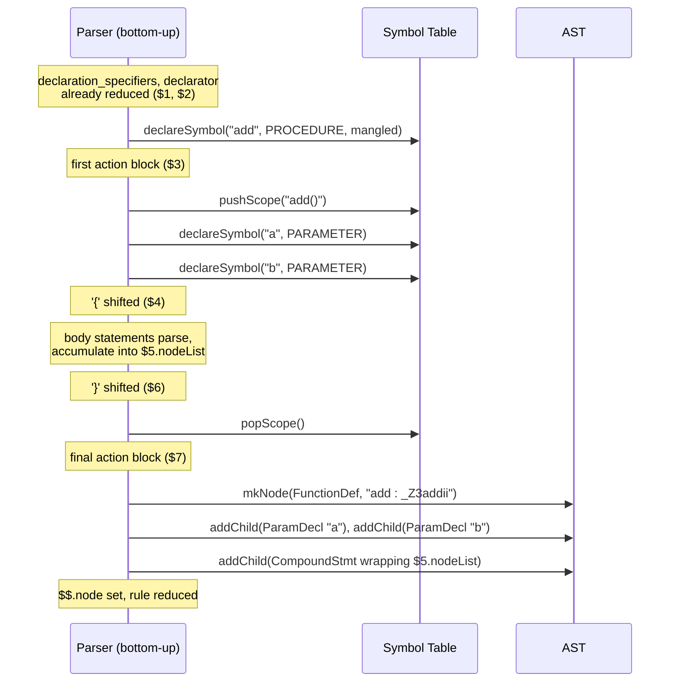

# Grammar Design Document — Phase 2 Syntax Analyzer

This document explains every major production in `src/parser.y`, the same
way the `if`/`else` walkthrough did: show the rule, show an example input,
map `$1`/`$2`/... to what they mean, show what AST gets built, and explain
any interesting ambiguity/precedence decisions behind the rule's shape.

> **Scope of this document.** It walks through the core productions. The
> rule excerpts are illustrative and were written before the newest
> additions (unnamed struct/union/enum bodies, `extern` / `register`,
> the `NEW_TYPE_END` precedence, typed name mangling), so
> [`../src/parser.y`](../src/parser.y) is the authority for the exact
> text of a rule. The current summary of the grammar is in
> [`../README.md`](../README.md#grammar-overview).

---

## 0. How to read every rule in this document

**`$1`, `$2`, `$3`, ...** refer to the values of the symbols on the
right-hand side, in order (including literal tokens like `'('`).

**`$$`** is the value being produced for the left-hand side — the
nonterminal being defined.

Every `$N` and `$$` here is one shared struct, `ParserValue` (see
`include/parser_value.h`), not a Bison `%union`. It carries several fields at
once; the ones that matter for a given rule are whichever ones that
rule's action reads or writes — `.str` (raw text), `.idx` (a token's
position in the token log), `.typeSpec`/`.decl` (type/declarator being
assembled), and `.node`/`.nodeList` (AST).

**`mkNode(kind, label, {children...})`** builds one AST node:

```cpp
mkNode(ASTKind::IfStmt, "", {$3.node, $5.node})
//     ^ what kind of    ^ text label     ^ child subtrees
//       node this is      (often empty)    (nullptr children are
//                                            silently skipped)
```

**AST trees below are drawn with `printAST()`'s actual output style** —
the same `|--`/`` `-- `` branch characters the tool prints, not
hand-drawn boxes, so what you see here is literally what running the
tool produces.

---

## Complete worked example: `function_definition`, explained line by line

Every other section in this document explains a rule briefly. This
one goes all the way through a single rule, `function_definition` —
chosen because it's the single most instructive rule in the whole
grammar: in one place, it touches mid-rule actions, scope push/pop,
symbol table registration, name mangling, out-of-class method
definitions, parameter handling, and AST construction from
already-accumulated data. If you understand every line of this one
rule, you understand most of the mechanisms the rest of this grammar
is built from.

### The requirement, in plain English

"A function definition is a return type, a name, a parenthesized
parameter list, and a `{ ... }` body. Register the function (and each
parameter) in the symbol table as they're seen. Once the body is
fully parsed, build one AST node representing the whole function."

### The exact rule, as it exists today

```yacc
function_definition
    : declaration_specifiers declarator {
          bool outOfClass = !$2.decl.className.empty();
          if (outOfClass) enterClass($2.decl.className);
          std::vector<std::string> paramTypes;
          for (auto &p : $2.decl.params) paramTypes.push_back(p.typeStr);
          std::string mangled = mangle($2.decl.name, paramExprs($2.decl.params), $2.decl.isVariadic, currentClassName());
          std::string returnType = computeTypeStr($1.typeSpec, $2.decl.pointerLevel, $2.decl.arrayLevel);
          SymbolDeclInfo extra;
          extra.tokenIdx = $2.decl.nameIdx;
          extra.isStatic = $1.typeSpec.isStatic;
          extra.isConst = $1.typeSpec.isConst;
          extra.isVolatile = $1.typeSpec.isVolatile;
          extra.pointerLevel = $2.decl.pointerLevel;
          extra.arrayLevel = $2.decl.arrayLevel;
          extra.returnType = returnType;
          extra.paramTypes = paramTypes;
          extra.mangledName = mangled;
          declareSymbol($2.decl.name, SymKind::PROCEDURE, "PROCEDURE", extra);
          setCategory($2.decl.nameIdx, "PROCEDURE");
          if (outOfClass) leaveClass();
          pushScope($2.decl.name + "()");
          for (auto &p : $2.decl.params) {
              if (p.nameIdx >= 0) {
                  SymbolDeclInfo pex;
                  pex.tokenIdx = p.nameIdx;
                  declareSymbol(p.name, SymKind::PARAMETER, p.typeStr, pex);
                  setCategory(p.nameIdx, p.typeStr);
              }
          }
      } '{' block_item_list_opt '}' {
          popScope();
          bool outOfClass = !$2.decl.className.empty();
          if (outOfClass) enterClass($2.decl.className);
          std::vector<std::string> paramTypes;
          for (auto &p : $2.decl.params) paramTypes.push_back(p.typeStr);
          std::string mangled = mangle($2.decl.name, paramExprs($2.decl.params), $2.decl.isVariadic, currentClassName());
          if (outOfClass) leaveClass();
          auto node = mkNode(ASTKind::FunctionDef, $2.decl.name + " : " + mangled);
          for (auto &p : $2.decl.params) {
              if (!p.name.empty()) addChild(node, mkNode(ASTKind::ParamDecl, p.name + " : " + p.typeStr));
          }
          auto body = mkNode(ASTKind::CompoundStmt);
          for (auto &s : $5.nodeList) addChild(body, s);
          addChild(node, body);
          $$.node = node;
      }
    ;
```

### Step 1: map every symbol to a position number

Bison numbers *every* symbol on the right-hand side left to right,
including mid-rule actions — a `{ ... }` block embedded partway
through a rule counts as its own numbered symbol, exactly as if it
were a nonterminal that always matches the empty string. Miscounting
this is one of the most common real mistakes when editing a rule like
this one (it's exactly what happened, and was caught by testing, when
this project's `if`/`else` dangling-else rule was first written with a
mid-rule action inserted in the wrong place — see §9 below).

| # | Symbol | What it is |
|---|---|---|
| `$1` | `declaration_specifiers` | The return type (`int`, `void`, ...) — already fully reduced, including any `static`/`const`/`volatile` |
| `$2` | `declarator` | The function's name, pointer/array depth on the return type, **and** its full parameter list (`d.params`) — already fully reduced |
| `$3` | *(mid-rule action)* | Everything in the first `{ ... }` block above — registers the function itself and its parameters, pushes the function's own scope |
| `$4` | `'{'` | The literal opening brace of the body |
| `$5` | `block_item_list_opt` | Every statement inside the body, already reduced into `$5.nodeList` (see §1/§6 for how left-recursive list rules accumulate this) |
| `$6` | `'}'` | The literal closing brace |
| `$7` | *(final action)* | Everything in the second `{ ... }` block — builds the actual `FunctionDef` AST node |

Two `{ ... }` action blocks in one rule is deliberate, not incidental:
the first one needs to run **before** the body is parsed (so parameter
names are already declared and visible when the body's own statements
reference them); the second needs to run **after** (so it has the
fully-built list of body statements to attach). Splitting the rule's
single conceptual job across two mid-points, rather than doing
everything at the end, is exactly what makes forward-referencing a
parameter from inside its own function's body work at all.

### Step 2: what `$2.decl` already contains, and why

By the time this rule's first action runs, `$2` (`declarator`) has
already been fully reduced — which means everything from `int add(int
a, int b)`'s parenthesized part has already been walked by `pointer`,
`direct_declarator`, and `parameter_list` (see §3), and the results are
sitting in one `DeclInfo` struct:

```cpp
struct DeclInfo {
    std::string name;        // "add"
    int nameIdx;              // token-log index of "add", for setCategory()/line lookup
    int pointerLevel;         // 0 (no * before "add")
    int arrayLevel;           // 0
    bool isFunction;          // true (this declarator has a parameter list)
    std::vector<DeclInfo> params;  // [{name:"a", typeStr:"INT", nameIdx:...}, {name:"b", ...}]
    std::string className;    // "" for a plain function; "Dog" for `Dog::bark(...)`
    ...
};
```

This is *why* `function_definition`'s own action code never has to
parse anything about the parameter list itself — that work already
happened, several rules earlier, and got handed up as plain data.

### Step 3: the first action, one statement at a time

```cpp
bool outOfClass = !$2.decl.className.empty();
if (outOfClass) enterClass($2.decl.className);
```
Handles `Dog::bark() { ... }` — an out-of-class method definition.
`$2.decl.className` only gets set by `direct_declarator`'s
`IDENTIFIER SCOPE_RES IDENTIFIER` form (see §3c); for an ordinary
function it's empty, `outOfClass` is `false`, and this whole branch is
inert. When it *is* a `Class::method` form, `enterClass()` is called
*temporarily* — just long enough to compute the right mangled name and
qualified symbol-table entry — mirroring what would already be active
automatically if this were an *inline* method (where `enterClass()`
was called back when the enclosing `class { ... }` body started, and
is still active here).

```cpp
std::vector<std::string> paramTypes;
for (auto &p : $2.decl.params) paramTypes.push_back(p.typeStr);
std::string mangled = mangle($2.decl.name, paramExprs($2.decl.params), $2.decl.isVariadic, currentClassName());
```
Hands each parameter's type expression (`paramExprs()`: the
`ASTTypeExpr` of every parameter) to `mangle()`, which builds the real
types and encodes them under the Itanium C++ ABI to produce `_Z3addii`
(`paramTypes`, the flat `"INT"` strings, is still kept for the
parse-time overload lookup).
`currentClassName()` — either freshly entered above, or already
active from an enclosing class body — is what makes `Dog::bark()`
mangle as `_ZN3Dog4barkEv` instead of a bare `_Z4barkEv`.

```cpp
std::string returnType = computeTypeStr($1.typeSpec, $2.decl.pointerLevel, $2.decl.arrayLevel);
```
The return type, computed the exact same way any variable's type
would be (`computeTypeStr()`) — `$1` is the return-type keyword(s),
`$2.decl.pointerLevel` handles `int *makeInt()` correctly returning
`INT_POINTER`, not `INT`.

```cpp
SymbolDeclInfo extra;
extra.tokenIdx = $2.decl.nameIdx;
extra.isStatic = $1.typeSpec.isStatic;
extra.isConst = $1.typeSpec.isConst;
extra.isVolatile = $1.typeSpec.isVolatile;
extra.pointerLevel = $2.decl.pointerLevel;
extra.arrayLevel = $2.decl.arrayLevel;
extra.returnType = returnType;
extra.paramTypes = paramTypes;
extra.mangledName = mangled;
declareSymbol($2.decl.name, SymKind::PROCEDURE, "PROCEDURE", extra);
setCategory($2.decl.nameIdx, "PROCEDURE");
```
Everything computed above gets bundled into one `SymbolDeclInfo` and
handed to `declareSymbol()` in a single call — this is the one place
the function itself actually gets written into both the scoped lookup
table and the permanent flat symbol table (see the two-structure
design in §10). `setCategory()` is the separate, simpler act of
patching *this specific token's* printed classification in the
Token/Token_Type table — two different jobs, done right next to each
other because they both need the same inputs.

```cpp
if (outOfClass) leaveClass();
```
Exits the temporary class context entered above — for an ordinary
function this is inert (never entered in the first place).

```cpp
pushScope($2.decl.name + "()");
for (auto &p : $2.decl.params) {
    if (p.nameIdx >= 0) {
        SymbolDeclInfo pex;
        pex.tokenIdx = p.nameIdx;
        declareSymbol(p.name, SymKind::PARAMETER, p.typeStr, pex);
        setCategory(p.nameIdx, p.typeStr);
    }
}
```
A **new** scope opens, labeled `"add()"` — this is the scope every
local variable and every parameter inside this function will belong
to, and it's exactly what makes the Scope column read `global >
add()` for anything declared in this function's body. Each parameter
gets declared into that brand-new scope, one at a time, so by the
time the body starts parsing, `a` and `b` are already valid,
resolvable identifiers.

### Step 4: the body parses — this is where `$5` comes from

Nothing in `function_definition` itself needs to do anything while
`block_item_list_opt` (position `$5`) is being parsed — every
statement inside `{ ... }` reduces on its own, through the ordinary
`statement`/`expr`/etc. machinery described throughout this document,
accumulating into `$5.nodeList` the same left-recursive way any
sibling list does (§1). By the time the closing `'}'` is reached,
`$5.nodeList` already holds one fully-built AST node per statement.

### Step 5: the final action — assembling the actual node

```cpp
popScope();
```
The function's own scope — opened in Step 3 — closes. Every parameter
and every local variable declared while it was open is now gone from
the *live* lookup table (though permanently preserved in the flat
`g_symbolTable`, per the two-structure design).

```cpp
bool outOfClass = !$2.decl.className.empty();
if (outOfClass) enterClass($2.decl.className);
std::vector<std::string> paramTypes;
for (auto &p : $2.decl.params) paramTypes.push_back(p.typeStr);
std::string mangled = mangle($2.decl.name, paramExprs($2.decl.params), $2.decl.isVariadic, currentClassName());
if (outOfClass) leaveClass();
```
The exact same mangled-name computation as Step 3, run a second time.
This *is* genuinely redundant work — `$2.decl` and `$1.typeSpec` are
still sitting right there on the parser stack, unchanged, so
recomputing `mangled` from scratch costs nothing incorrect, just a
few wasted string operations. It's done this way specifically because
Bison's mid-rule actions don't have a clean built-in way to pass a
computed *local* value from one action block to a later one in the
same rule other than recomputing it or writing it into `$$` early —
and writing intermediate state into `$$` before the rule is fully
reduced risks exactly the kind of stale-`yyval` bug this project has
already been bitten by once (§9). Recomputing three cheap string
operations is the safer trade.

```cpp
auto node = mkNode(ASTKind::FunctionDef, $2.decl.name + " : " + mangled);
for (auto &p : $2.decl.params) {
    if (!p.name.empty()) addChild(node, mkNode(ASTKind::ParamDecl, p.name + " : " + p.typeStr));
}
auto body = mkNode(ASTKind::CompoundStmt);
for (auto &s : $5.nodeList) addChild(body, s);
addChild(node, body);
$$.node = node;
```
The actual tree gets built, last: one `FunctionDef` node labeled with
the name and mangled signature, one `ParamDecl` child per parameter
(read straight back out of `$2.decl.params` — the exact same data
Step 3 already used to *declare* them, now reused to *describe* them
in the tree), and one `CompoundStmt` wrapping every statement already
sitting in `$5.nodeList`. `$$.node` is set last, handing the finished
subtree up to whatever rule reduces next (`external_decl`, and from
there `translation_unit`'s accumulating list, per §1).

### Seeing the whole thing happen



### Verified against real output

```c
int add(int a, int b) {
    return a + b;
}
```
```
FunctionDef "add : _Z3addii"
|-- ParamDecl "a : INT"
|-- ParamDecl "b : INT"
`-- CompoundStmt
    `-- ReturnStmt
        `-- BinaryExpr "+"
            |-- Identifier "a"
            `-- Identifier "b"
```
and in the symbol table: `add` shows kind `procedure`, scope `global`,
signature `INT (INT, INT)`, mangled name `_Z3addii`; `a` and `b` each
show kind `parameter`, scope `global > add()`.

---

## 1. Program structure

```yacc
translation_unit
    : /* empty */ {
          $$.node = mkNode(ASTKind::Program, "translation_unit");
          g_astRoot = $$.node;
      }
    | translation_unit external_decl {
          $$ = $1;
          addChild($$.node, $2.node);
          g_astRoot = $$.node;
      }
    ;

external_decl
    : function_definition { $$.node = $1.node; }
    | declaration          { $$.node = $1.node; }
    | error ';'  { yyerrok; }
    | error '}'  { yyerrok; }
    ;
```

This is **left recursion** — the standard, LALR-safe shape for "zero or
more of X" (see §9 for why right recursion is dangerous). Each time
`translation_unit external_decl` reduces, one more top-level declaration
or function gets appended as a child of the running `Program` node.
`g_astRoot` is reassigned every single reduction; the *last* assignment
— once the whole file has been consumed — is the final, complete tree.

`external_decl`'s last two alternatives aren't real syntax — `error` is
Bison's special recovery token. If something at the top level doesn't
parse, discard input until the next `;` or `}` and keep going, instead
of aborting the whole file on the first mistake.

**Example** — `int x; int y;` produces:
```
Program "translation_unit"
|-- VarDecl "x : INT"
`-- VarDecl "y : INT"
```

---

## 2. Declarations: `declaration_specifiers` + `init_declarator_list`

This is the "one type, many declarators" problem — `int a, *b, c[3];`
declares three different *shapes* of `int` from one type specifier.
Two separate accumulators solve it.

```yacc
declaration
    : declaration_specifiers init_declarator_list_opt ';' {
          std::vector<ASTNodePtr> declNodes;
          for (auto &d : $2.paramList) {
              auto n = registerDeclarator(d, $1.typeSpec);
              if (n) declNodes.push_back(n);
          }
          ...
      }
    ;
```

- `$1` = `declaration_specifiers` → the accumulated *type* (`int`,
  `unsigned long`, `struct Point`, ...), built up in `$1.typeSpec`.
- `$2` = `init_declarator_list_opt` → a **list** of `DeclInfo`
  structs, one per comma-separated declarator (`a`, `*b`, `c[3]`),
  each already knowing its own pointer depth / array depth / name —
  but *not yet* combined with the type, since the type only exists
  once as `$1`.

The combining happens in the `for` loop: each `DeclInfo` from `$2` is
paired with the *same* `$1.typeSpec` via `registerDeclarator()`, which
is where `computeTypeStr()` actually concatenates them into a printable
type like `"INT_POINTER"`.

**Example** — `int a, *b, c[3];`:
```
DeclGroup
|-- VarDecl "a : INT"
|-- VarDecl "b : INT_POINTER"
`-- VarDecl "c : INT_ARRAY"
```
(A single declarator, e.g. `int a;` alone, skips the `DeclGroup`
wrapper and returns the one `VarDecl` node directly — no point nesting
a list of one.)

### Why is the accumulation two-step instead of one?

An earlier version tried to set a *global* "current type" the moment
`declaration_specifiers` finished reducing, so each `init_declarator`
could register itself immediately. That created a genuine bug: a
function's own parameter list (`int a, b(char x), c;`) *also* reduces
a nested `declaration_specifiers` for `x`'s type, which clobbered the
outer global before `c` got a chance to read it. Collecting every
`DeclInfo` first and combining them all at the very end, in one place,
avoids the clobbering entirely — this is the general fix for
"inherited attribute" problems in a bottom-up parser: don't push a
value down via a mutable global, collect it and combine top-down once
everything is known.

---

## 3. Declarators — pointers, arrays, function shapes

### 3a. Pointers

```yacc
pointer
    : '*'         { $$.decl.pointerLevel = 1; }
    | '&'         { $$.decl.pointerLevel = 1; }
    | pointer '*' { $$ = $1; $$.decl.pointerLevel++; }
    ;
```

Left-recursive on purpose (see §9 — this is the rule that broke when I
first wrote it right-recursive). `int **p` reduces `*` twice, each
time incrementing `pointerLevel`, ending at `2`.

### 3b. Arrays

```yacc
direct_declarator
    | direct_declarator '[' ']'                 { $$ = $1; $$.decl.arrayLevel++; }
    | direct_declarator '[' assignment_expr ']' { $$ = $1; $$.decl.arrayLevel++; }
```

Same idea, applied by repetition rather than recursion inside one
nonterminal: `int a[2][3]` matches this rule *twice* in a row (each
`[...]` extends the *same* `direct_declarator`), so `arrayLevel` ends
at `2` after two passes.

**Example** — `int matrix[2][2];`:
```
VarDecl "matrix : INT_ARRAY_ARRAY"
```
(One `_ARRAY` suffix per dimension — this used to collapse to a single
`_ARRAY` regardless of depth, which was a real bug fixed alongside the
pointer-depth one.)

### 3c. Function declarators, and the function-pointer disambiguation

```yacc
direct_declarator
    : IDENTIFIER { $$.decl.name = $1.str; $$.decl.nameIdx = $1.idx; }
    | '(' declarator ')' { $$ = $2; $$.decl.wasParenGrouped = true; }
    | direct_declarator '(' { pushScope(); } parameter_list_opt ')' {
          $$ = $1;
          if ($1.decl.wasParenGrouped && $1.decl.pointerLevel > 0) {
              $$.decl.isFunctionPointer = true;   // fp: a VARIABLE
          } else {
              $$.decl.isFunction = true;           // add: a real function
          }
          $$.decl.wasParenGrouped = false;
          $$.decl.params = $4.paramList;
          popScope();
      }
    | direct_declarator '[' ... ']' { ... }
    ;
```

Two declarations that *look* structurally identical at the token level
need to be told apart:

| Input | Parses via | Meaning |
|---|---|---|
| `int add(int a, int b);` | `IDENTIFIER` then function-call form | a function |
| `int (*fp)(int, int);` | `'(' declarator ')'` (grouped `*fp`) *then* function-call form | a **variable** whose type is "pointer to function" |

The `wasParenGrouped` flag is the signal: it's only set by the
parenthesized-grouping alternative. When the function-call-shaped
extension sees that flag *and* a nonzero `pointerLevel` already sitting
on what it's extending, that combination can only mean "the star was
inside the parens" — i.e. a function pointer variable, not a real
function declaration.

**Example** — `int (*fp)(int, int);`:
```
VarDecl "fp : INT_FUNCTION_POINTER"
```
versus `int add(int a, int b);`:
```
FunctionDecl "add : _Z3addii"
|-- ParamDecl "a : INT"
`-- ParamDecl "b : INT"
```

---

## 4. Structures, classes, enums, unions, inheritance

All four keyword-introduced type declarations share one nonterminal,
`struct_or_class_specifier`, because they have the identical shape:
`KEYWORD name { members }` or just `KEYWORD name` (referencing an
existing one). Shown here for `class`; `struct`/`union`/`enum` are the
same pattern with a different `SymKind`/AST-kind pair.

```yacc
struct_or_class_specifier
    : CLASS IDENTIFIER {
          declareSymbol($2.str, SymKind::CLASS_TAG, "CLASS", ...);
          enterClass($2.str);
      } inheritance_opt '{' { pushScope(); } member_decl_list_opt '}' {
          popScope(); leaveClass();
          std::string label = $2.str;
          if (!$4.str.empty()) label += " : " + $4.str;
          auto node = mkNode(ASTKind::ClassDecl, label);
          for (auto &m : $7.nodeList) addChild(node, m);
          $$.node = node;
      }
```

Position map:
```
CLASS IDENTIFIER {action} inheritance_opt '{' {pushScope} member_decl_list_opt '}' {final}
  1       2         3            4          5        6                7          8
```
`$4` = `inheritance_opt`'s accumulated `" : Animal, Comparable"`-style
text (empty if there's no `:` clause). `$7` = every member's AST node,
collected into `nodeList` by `member_decl_list`. `enterClass()`/
`leaveClass()` bracket the member parse so that a constructor inside
the class body can be told apart from a function returning that class
type (see §5).

**Example** — `class Dog : public Animal { public: int legs; };`:
```
ClassDecl "Dog : Animal"
`-- VarDecl "legs : INT"
```

---

## 5. Constructors and destructors

```yacc
constructor_def
    : IDENTIFIER '(' { pushScope(); } parameter_list_opt ')' {
          setCategory($1.idx, "CONSTRUCTOR");
          /* register each param in the new scope */
      } compound_stmt {
          popScope();
          std::string mangled = mangle($1.str, paramTypes, currentClassName());
          ...
          auto node = mkNode(ASTKind::ConstructorDef, $1.str + " : " + mangled);
          ...
          addChild(node, $7.node);
          $$.node = node;
      }
    ;
```

Nothing marks this as special *syntactically* except what's absent: no
return type before the name. `member_item` simply offers
`constructor_def` as one more alternative alongside ordinary
`function_definition`, and since a genuine function member always
needs `declaration_specifiers` first (a type keyword), while this rule
starts on a bare `IDENTIFIER`, there's no ambiguity between the two —
different first tokens.

`currentClassName()` — read here for the mangled name — is whatever
`enterClass()` set when this constructor's *enclosing* class body
started being parsed (§4), which is exactly why `enterClass()`/
`leaveClass()` needed to bracket the member list in the first place.

**Example** — inside `class Dog { public: Dog(int n) { legs = n; } };`:
```
ConstructorDef "Dog : _ZN3Dog3DogEi"
|-- ParamDecl "n : INT"
`-- CompoundStmt
    `-- ExprStmt
        `-- AssignExpr "="
            |-- Identifier "legs"
            `-- Identifier "n"
```

---

## 6. Statements

### 6a. `if` / `if`-`else` — the dangling-else problem

*(This is the rule from the document you shared — included here for
completeness, with the precedence mechanics spelled out.)*

```yacc
%nonassoc IFX
%nonassoc ELSE
...
selection_stmt
    : IF '(' expr ')' statement %prec IFX {
          $$.node = mkNode(ASTKind::IfStmt, "", {$3.node, $5.node});
      }
    | IF '(' expr ')' statement ELSE statement {
          $$.node = mkNode(ASTKind::IfStmt, "", {$3.node, $5.node, $7.node});
      }
```

`if (a) if (b) x=1; else x=2;` is genuinely ambiguous English-BNF: the
`else` could belong to either `if`. Real C/C++ semantics say "the
nearest unmatched `if`." `IFX` is a **pseudo-token** — the scanner
never produces it, it exists purely to hang a precedence level on. A
rule's default precedence comes from the *last terminal in its RHS*;
for `IF '(' expr ')' statement`, that would be `')'`, which has no
declared precedence at all here, so `%prec IFX` overrides it
explicitly. Since `ELSE` is declared *after* `IFX` (higher on the
precedence ladder), when the parser is sitting on a just-finished
`if (cond) stmt` with `ELSE` as lookahead, comparing precedences
(`IFX` low vs. `ELSE` higher) picks **shift** — attach the `else` to
this innermost `if` rather than reducing it away first.

`%nonassoc` (not `%left`/`%right`) because these aren't real chained
operators — they're pure ranking markers with no meaningful
associativity of their own.

**Example** — nested `if` with one `else`:
```
IfStmt
|-- Identifier "a"
`-- IfStmt
    |-- Identifier "b"
    |-- ExprStmt ... (x = 1)
    `-- ExprStmt ... (x = 2)
```
Note the *inner* `IfStmt` has three children (condition/then/else);
the *outer* has two (no else) — that shape *is* the proof the `else`
attached correctly.

### 6b. Loops

```yacc
iteration_stmt
    : WHILE '(' expr ')' statement                             { WhileStmt(cond, body) }
    | DO statement WHILE '(' expr ')' ';'                       { DoWhileStmt(body, cond) }
    | UNTIL '(' expr ')' statement                              { UntilStmt(cond, body) }
    | FOR '(' expr_stmt expr_stmt for_incr_opt ')' statement    { ForStmt(init, cond, incr, body) }
    | FOR '(' declaration expr_stmt for_incr_opt ')' statement  { ForStmt(init, cond, incr, body) }
    ;
```

Two `for` forms exist because C89-style `for (i = 0; ...)` and
C99-style `for (int i = 0; ...)` have genuinely different first
symbols (`expr_stmt` starts with an expression or bare `;`;
`declaration` starts with a type keyword) — no ambiguity, so both can
coexist as separate alternatives rather than one contorted rule trying
to cover both.

`for_incr_opt` being empty vs. present is the reason a `for` loop with
no increment (`for (i=0; i<n; )`) prints with **3** children instead
of 4 — `mkNode()`'s child list silently drops `nullptr` entries, so an
omitted optional part is simply absent from the tree rather than shown
as an explicit empty placeholder.

### 6c. `switch` / `case` / `default`

```yacc
selection_stmt : SWITCH '(' expr ')' compound_stmt { SwitchStmt(subject, body) } ;

labeled_stmt
    : CASE constant_expr ':' statement { CaseStmt(value, stmt) }
    | DEFAULT ':' statement            { DefaultStmt(stmt) }
    | IDENTIFIER ':' statement         { declareSymbol(..., LABEL); LabeledStmt(name, stmt) }
    ;
```

`case`/`default`/goto-labels are grouped into one nonterminal,
`labeled_stmt`, because they're structurally identical — "some marker,
then a statement" — even though `case`/`default` only make sense
inside a `switch` body and a goto-label doesn't. The grammar doesn't
enforce that placement rule (that would be a semantic check); it just
recognizes the shared shape.

### 6d. Jump statements

```yacc
jump_stmt
    : BREAK ';'    { BreakStmt }
    | CONTINUE ';' { ContinueStmt }
    | RETURN ';' | RETURN expr ';' { ReturnStmt([value]) }
    | GOTO IDENTIFIER ';' {
          const Symbol *s = lookupSymbol($2.str);
          if (s) setCategory($2.idx, "LABEL");
          recordUsage($2.str);
          GotoStmt(labelName)
      }
    ;
```

`GOTO`'s target is looked up in the symbol table the same way any
identifier use is — if the label was already declared *before* this
point in the file (single-pass parsing means forward gotos won't
resolve), its token gets classified `LABEL` instead of the generic
`IDENTIFIER` fallback.

---

## 7. Expressions

### 7a. The flat, precedence-resolved `binary_expr`

Instead of writing ten separate precedence-layer nonterminals
(`additive_expr`, `multiplicative_expr`, ...), every binary operator is
a sibling alternative of one nonterminal, and the precedence table
resolves which one wins:

```yacc
%left OR_OP
%left AND_OP
%left '|'
%left '^'
%left '&'
%left EQ_OP NE_OP
%left '<' '>' LE_OP GE_OP
%left SHL SHR
%left '+' '-'
%left '*' '/' '%'
```
```yacc
binary_expr
    : binary_expr OR_OP binary_expr  { BinaryExpr("||", left, right) }
    | binary_expr '+' binary_expr    { BinaryExpr("+", left, right) }
    | binary_expr '*' binary_expr    { BinaryExpr("*", left, right) }
    ... (16 more, one per operator)
    | unary_expr { $$.node = $1.node; }
    ;
```

Lower in the `%left` list = binds tighter. `a + b * c` is genuinely
ambiguous as written (could group either way) — the table says `*`
binds tighter than `+`, so the parser always prefers reducing the
multiplication first.

**Example** — `a + b * c`:
```
BinaryExpr "+"
|-- Identifier "a"
`-- BinaryExpr "*"
    |-- Identifier "b"
    `-- Identifier "c"
```

### 7b. Unary operators, casts, `sizeof`, `new`/`delete`

```yacc
unary_expr
    : postfix_expr
    | '&' unary_expr %prec ADDR   { UnaryExpr("&", operand) }
    | '*' unary_expr %prec DEREF  { UnaryExpr("*", operand) }
    | '(' type_name ')' unary_expr %prec CAST { CastExpr(typeName, operand) }
    | SIZEOF unary_expr %prec CAST            { SizeofExpr(operand) }
    | SIZEOF '(' type_name ')'                { SizeofExpr(typeName) }
    | NEW type_name                            { NewExpr(typeName) }
    | DELETE unary_expr                        { DeleteExpr(operand) }
    ;
```

`%prec ADDR`/`%prec DEREF`/`%prec CAST` all point at high-precedence
pseudo-tokens (declared `%right`, above even `*`/`/`) so that `*p * 2`
parses as `(*p) * 2` (dereference binds tighter than multiply) instead
of the parser trying to treat the leading `*` as a binary operator
with nothing on its left.

### 7c. Postfix operations

```yacc
postfix_expr
    : primary_expr
    | postfix_expr '[' expr ']'                  { IndexExpr(base, index) }
    | postfix_expr '(' argument_list_opt ')'      { CallExpr(callee, args...) }
    | postfix_expr '.' IDENTIFIER                 { MemberExpr(base, "field") }
    | postfix_expr ARROW IDENTIFIER                { ArrowExpr(base, "field") }
    | postfix_expr INC                              { PostfixOpExpr("++", operand) }
    ;
```

Left-recursive on `postfix_expr` itself, which is what makes chains
like `obj.a[0]->b(1,2)++` parse naturally — each step extends the
*previous* postfix result, building a deeper tree left-to-right rather
than needing separate grammar for every possible chain shape.

---

## 8. The typedef / class-name "lexer hack"

Not a grammar rule by itself, but it changes how several rules above
even *can* work. `MyInt x;` is ambiguous to an LALR(1) grammar without
help: is `MyInt` a type or a variable being multiplied by something?
The fix is scanner–parser cooperation:

```cpp
// parser side, once a typedef (or a class/struct/enum's closing '}') is seen:
addTypeName(name);   // scoped -- see the update below
```
```flex
// scanner side, for every identifier matched:
if (isTypeName(yytext)) return TYPE_NAME;   // not IDENTIFIER
```

That one-token difference (`TYPE_NAME` vs. `IDENTIFIER`) is what lets
`declaration_specifiers` accept `MyInt` as a type-specifier without
any backtracking. It's also why class/struct/enum tags are registered
into the *same* set right after their closing `}` — so `Dog d;` works
without repeating the `class` keyword, matching real C++ (unlike
plain C, which always needs `struct Foo x;`).

*Update:* the set is now scoped (`addTypeName` / `hideTypeName` /
`isTypeName`, pushed and popped with the symbol table), a typedef'd name
right after a type keyword is returned as `IDENTIFIER` so it can be
redeclared, and a class's own name is a type inside its body except
directly before `(` (a constructor). See the phase 2 README's lexer-hack
section and "C++ and C99 syntax additions".

---

## 9. Recursion direction: the one rule that got this wrong

Every repeated-element rule in this grammar is **left-recursive**
(`list: list item | item`) except the very first draft of `pointer`,
which was written right-recursive (`pointer: '*' | '*' pointer`) and
broke on `char **p;`. The mechanism (briefly, see the full grammar
build conversation for the complete trace): `pointer` is reused in two
different contexts — plain declarators and cast/`sizeof`/`new`
type-names — and LALR merges automaton states with identical cores
across those two uses. The merged state ended up making a precedence
decision that only made sense for the cast/`sizeof` context, and
silently applied it to the plain-declarator context too, breaking the
second `*` in `**`.

**The general lesson, not just the specific fix:** always write
repetition as left recursion. It's not just a style preference — right
recursion creates exactly this class of state-sharing risk, and
whether it actually bites you depends on unrelated parts of the
grammar you can't predict just by reading the rule in isolation.

---

## 10. Symbol table & mangling (grammar-adjacent, not grammar itself)

Every rule above that calls `declareSymbol()` is writing into **two**
structures at once: a scope-stack map (`pushScope()`/`popScope()`)
used for `lookupSymbol()` during parsing, and a permanent, append-only
`g_symbolTable` used only for the final printed report (scopes are
discarded once popped, so nothing would survive to print otherwise).
`mangle()` turns a name + the parameters' type expressions (+ optional
enclosing class, from `currentClassName()`) into the Itanium C++ ABI
link name g++ would emit, like `_Z3addii`, `_ZN3Dog4barkEv` or
`_ZN3DogC1ERKS_` (see `shared/symbol_table/symbol_table.hpp`, section
4b).

---

## Quick-reference: where to look for each feature

| Feature | Rule(s) | Section |
|---|---|---|
| Declarations, multi-declarator lists | `declaration`, `init_declarator_list` | §2 |
| Pointers, multi-level pointers | `pointer` | §3a, §9 |
| Arrays, multi-dimensional arrays | `direct_declarator '[' ']'` | §3b |
| Functions, function pointers | `direct_declarator '(' ')'` | §3c |
| struct/union/class/enum, inheritance | `struct_or_class_specifier` | §4 |
| Constructors/destructors | `constructor_def`/`destructor_def` | §5 |
| if/else | `selection_stmt` | §6a |
| for/while/do-while/until | `iteration_stmt` | §6b |
| switch/case/default | `selection_stmt`, `labeled_stmt` | §6c |
| goto/break/continue/return | `jump_stmt` | §6d |
| Arithmetic/logical operators | `binary_expr` | §7a |
| Pointers/casts/sizeof/new/delete in expressions | `unary_expr` | §7b |
| Function calls, array indexing, member access | `postfix_expr` | §7c |
| typedef, class-name-as-type | lexer hack | §8 |
