# Phase 2b — Semantic Analyzer

Walks the parser's AST, builds a persistent typed symbol table, checks
every static rule of the language, and annotates the tree with types,
lvalue-ness, constant values and resolved symbols — the representation
the (future) IR phase will lower.

> Status: **implemented and tested** (82 automated checks, all
> passing). This is the last implemented phase: nothing consumes its
> output yet.

## Purpose

Find every program that is grammatically correct but meaningless or
ill-typed — undeclared and duplicate names, type mismatches, invalid
operands, wrong calls, misplaced `break`/`case`, access violations … —
and, for correct programs, record everything later phases need: the
type of every expression, which declaration every name refers to, where
every object lives, and the memory layout of every record.

## Input

A source file path: `./semantic_analyzer [-q] file.c`. The executable
contains the preprocessor and phase 2's scanner and parser (its makefile
compiles [`../phase2-parser/src/parser.y`](../phase2-parser/src/parser.y)
and `scanner.l` into its own `build/`). If there are preprocessor or
syntax errors, it reports them and stops:
`Syntax analysis failed: N error(s); semantic analysis was not run.`
Otherwise the AST (`g_astRoot`) is analysed.

## Output

| Outcome | stdout | stderr | exit |
|---|---|---|---|
| no errors | `Semantic analysis successful: 0 error(s), W warning(s) …`, then `=== Annotated AST ===`, `=== Semantic Symbol Table ===`, `=== Record Layouts (MIPS32) ===` (omitted with `-q`) | warnings | 0 |
| errors | — | `Semantic analysis failed: E error(s), W warning(s) …`, then every diagnostic in source order | 1 |

Diagnostics look like gcc's:
`file:line:col: semantic error: message [category]`, followed by the
source line and a caret. A report goes to `logs/<file-stem>.log`.

## Architecture



| File | Contents (functions are members of `sem::SemanticAnalyzer` unless noted) |
|---|---|
| [`include/semantic.h`](include/semantic.h) | the class: contexts (`FunctionCtx`, `SwitchCtx`), state, every method below |
| [`src/declarations.cpp`](src/declarations.cpp) | `error()` / `warning()`, `analyze()`, `prescan()`, `hoistFunction()`; type resolution `resolveType()`, `resolveSpecifiers()`, `resolveTag()`, `resolveParams()`, `arrayDimension()`; `declaration()`, `variable()`, `typedefDecl()`, `functionSignature()`, `functionDefinition()`, `functionBody()`, `recordDefinition()`, `checkInitializer()`, `checkMainSignature()`, anonymous struct members |
| [`src/statements.cpp`](src/statements.cpp) | `statement()`, `subStatement()`, `blockItems()`, `condition()`, `collectLabels()`, `returnStatement()` |
| [`src/expressions.cpp`](src/expressions.cpp) | `expr()` dispatcher and `value()`; `identifier()`, `binary()`, `unary()`, `assignment()`, `ternary()`, `call()`, `builtinCall()`, `member()`, `scopeMember()`, `index()`, `cast()`, `sizeofExpr()`; `checkModifiable()`, `convertible()`, `checkConstantConversion()`, `resolveOverload()`, `checkCallArgs()`, `checkAccess()`, `checkFormat()`, `foldBinary()` |
| [`src/cxx.cpp`](src/cxx.cpp) | constructors (`construct()`, `defaultConstruct()`, `constructorInit()`, `constructExpr()`), `newExpr()`, out-of-class constructors/destructors, operator overloading (`checkOperatorDeclaration()`, `overloadedOperator()`), `varargBuiltin()` |
| [`src/sequencing.cpp`](src/sequencing.cpp) | `checkSequencing()` — the sequence-point pass |
| [`src/report.cpp`](src/report.cpp), [`include/report.h`](include/report.h) | `printAnnotatedAST()` |
| [`src/main.cpp`](src/main.cpp) | driver: preprocess, parse, `SymbolTable table; SemanticAnalyzer(table).analyze(g_astRoot)`, print |
| `../shared/types/` | the type system: `Type`, `RecordInfo`, constructors (`pointerTo`, `arrayOf`, `functionType` …), predicates, `sameType()`, `implicitConversion()`, `checkCast()`, `usualArithmetic()`, `integerPromotion()`, `decay()`, `sizeOf()`, `layoutRecord()`, `lookupMember()`, `wrapToType()` |
| `../shared/symbol_table/` (part 2) | `sem::Symbol`, `sem::Scope`, `sem::SymbolTable` — see [`../docs/SYMBOL_TABLE.md`](../docs/SYMBOL_TABLE.md) |

## Data structures

- **`sem::SymbolTable`** — persistent scope tree with an active stack
  ([full description](../docs/SYMBOL_TABLE.md#part-2--the-semantic-table-semsymboltable)).
- **`sem::Type`** — structural types: `Pointer(Pointer(Int))`,
  `Array(3, Array(4, Int))`, `Function(ret, params, variadic)`,
  `Record` → `RecordInfo`, plus `Reference`, `Opaque` (`va_list`) and
  `Error`. A `Function` type only describes a declared function: there
  are no function pointers, so a function is never a value.
  Sizes and layouts follow MIPS32 (ILP32).
- **`FunctionCtx`** (a stack, `fns`) — one per function or method
  body being analysed: return type, `breakables` (`'L'` loop / `'S'`
  switch, innermost last), loop depth, `switches` (each a `SwitchCtx`
  with the subject type, case values seen, default line), the function's
  `labels`, its class.
- **AST annotation slots** (in `ASTNode`): `semType`, `symbol`,
  `isLValue`, `hasConstValue` / `constValue`.
- `reported` — keys of messages already reported (one report per
  message and position); `errors`, `warnings` counters.

## How the analysis runs

```
analyze(root)
 ├─ prescan(root)              record every top-level function and variable line
 ├─ for each top-level item:   declaration(item, Global)      ← one walk, in source order
 │     VarDecl → variable()    FunctionDef → functionDefinition() → functionBody()
 │     StructDecl/ClassDecl → recordDefinition() (member bodies after the class is complete)
 │     TypedefDecl → typedefDecl()
 ├─ checkSequencing(root)      sequence-point warnings (needs the symbols)
 └─ undefined-function / undefined-extern-variable warnings
```

It is a single **L-attributed traversal**: declarations push types
*down* into the symbol table; expressions synthesize their type *up*.
Language decisions:

- Objects, typedefs and tags are **declare-before-use** (C). A variable
  used before its declaration gets `… it is declared later, at line N`.
- File-scope **functions may be called before their declaration**: on
  first use, `hoistFunction()` declares the function from the
  declaration `prescan()` found.
- Inside a class every member is visible to every method body (bodies
  are analysed after the class is complete, as in C++).
- Labels have function scope (collected before the body is walked), so
  a forward `goto` works.
- `int x; int x;` is an error even at file scope; `extern int x;`
  followed by `int x = 1;` is one object.
- `auto x = expr;` takes the type of the initializer.

### Declarations

`variable()` resolves the declared type with `resolveType()` — which
reads the declarator **inside-out** (`int (*pa)[3]` is a pointer to an
array, `int *pa[3]` an array of pointers) — then:

1. infers an unsized array's length from its initializer;
2. rejects `void` and incomplete objects (unless only declared `extern`);
3. handles linkage (`extern` declarations and the definition share one
   symbol; their composite type completes `extern int a[];`);
4. detects redeclaration with `st.lookupLocal(name)`;
5. creates the `sem::Symbol` (storage `Global`/`Static`/`Local`) and
   `st.declare()`s it, registering locals in the function's `locals`;
6. checks the initializer with `checkInitializer()` (brace lists,
   designators, nested aggregates, constant initializers for statics).

### Expressions

`expr(n)` dispatches on the node kind and stores the result in
`n->semType`; `value(n)` is `expr()` followed by `decay()` (arrays to
pointers, references to what they refer to).

- **Identifiers** — `identifier()` uses `st.lookup()`; see
  [the lookup example](../docs/SYMBOL_TABLE.md#example-x--y--z). A
  function name reaching `identifier()` is an error (`reference to
  function 'f' must be called`): callees are resolved by `call()`, so
  this can only be a function used as a value.
- **Binary operators** — `binary()` checks operand categories per
  operator (`%`, shifts and bitwise need integers; `+`/`-` allow pointer
  arithmetic; comparisons allow compatible pointers and null constants;
  `&&`, `||` need scalars), computes the result type with the usual
  arithmetic conversions, and folds constants with `foldBinary()`.
- **Assignment** — `assignment()`: a user `operator=` first; otherwise
  `checkModifiable()` on the left (lvalue, not an array, not `const`, no
  `const` member) and `convertible()` for the right.
- **Calls** — `call()`: the callee may be a function (overloads →
  `resolveOverload()`) or an object with `operator()`; `checkCallArgs()` checks the count and converts each
  argument as if by assignment.
- **Members** — `member()` with `lookupMember()` (base classes
  included) and `checkAccess()`; `.` on a pointer suggests `->`.
- **Subscripts, casts, `sizeof`, `new`** — `index()`,
  `cast()` (`checkCast()`), `sizeofExpr()`, `newExpr()`.
- **Constants** — integer constant expressions are folded **in their
  own type** (`wrapToType()`): `-1 < 0u` is false, `~0u` is
  `4294967295`; signed overflow, shift counts and value-changing
  conversions (`char c = 300`) are warned about.



### Statements and control flow

`statement()` handles each statement kind. `if`/`while`/`do`/`for`/
`until` conditions go through `condition()` (must be scalar). Loop and
switch bodies are analysed with the kind pushed on
`FunctionCtx::breakables`, so `break` is valid inside either and
`continue` only inside a loop. A `switch` pushes a `SwitchCtx`: case
labels must be integer constants, and folded values that repeat
(`'a'` and `97`) are reported with the earlier line. `goto` targets
are looked up in the labels collected by `collectLabels()`. Compound
statements and the bodies of `if`/loops each get a Block scope
(`subStatement()`).

### Functions



`functionSignature()` registers (or matches) the function symbol —
overloads share a name, a different return type with the same
parameters is `conflicting types` — and gives it its Itanium mangled
name. `functionDefinition()` rejects a second body and calls
`functionBody()`, which opens the Function scope, declares the
parameters, collects labels, analyses the body in the same scope (as in
C), and warns if a non-`void` function has no `return` at all.
`returnStatement()` checks each `return` against the declared return
type. Details:
[`../docs/SYMBOL_TABLE.md`](../docs/SYMBOL_TABLE.md#function-symbols).

### Pointers, arrays, structures

Pointers are chains of `Pointer` types; `&` needs an lvalue (and not a
`register` variable), `*` needs a non-`void` pointer; qualifiers may be
added but not dropped in conversions. Arrays are nested `Array` types
with constant positive sizes; `a[i]` needs a pointer/array and an
integer, with a warning for constant out-of-range indices.
`recordDefinition()` builds a `RecordInfo`, checks members, lays the
record out for MIPS32 and analyses member bodies afterwards; member
access resolves through base classes and checks `public` /
`protected` / `private`.

### Errors

`error(at, message, category)` / `warning(...)` call the shared
`reportDiagnostic()` with kind `Semantic error` / `Semantic warning` and
append the category (`[redeclaration]`, `[type-mismatch]` …); a message
already reported at the same position is dropped. An expression that
failed gets `TypeKind::Error`, which every rule accepts silently, so one
mistake produces one message. Analysis always continues to the end;
`main.cpp` prints the diagnostics sorted by position. Warnings never
change the exit status.

### Sequence points

`checkSequencing()` ([`src/sequencing.cpp`](src/sequencing.cpp)) runs
after typing. For each full expression it computes, bottom-up, which
variables (and member paths `s.x`) each subexpression writes and reads,
following C's evaluation order: operands of most operators and the
arguments of a call are unsequenced; `&&`, `||`, `?:`, `,` and the call
itself are sequence points. A write unsequenced with another access to
the same object gives gcc's warning `operation on 'i' may be undefined`
(`i = i++`, `a[i] = i++`, `f(i++, i++)`).

## Example

[`../docs/examples/add.c`](../docs/examples/add.c), verified with the
current build. Annotated AST (excerpt) — each node shows `<type>`,
`lvalue`, `=constant` and `-> symbol`:

```
`-- FunctionDef "main : main"  <int (void)>  -> main (function)
    `-- CompoundStmt
        |-- VarDecl "x : INT"  <int>  -> x.4 (variable, local)
        |   `-- IntLiteral "2"  <int> =2
        |-- CompoundStmt
        |   |-- VarDecl "x : INT"  <int>  -> x.5 (variable, local)
        |   |   `-- IntLiteral "3"  <int> =3
        |   `-- ExprStmt
        |       `-- AssignExpr "="  <int>
        |           |-- Identifier "global"  <int> lvalue  -> global (variable, global)
        |           `-- CallExpr  <int>  -> _Z3addii (function)
        |               |-- Identifier "add"  <int (int, int)>  -> _Z3addii (function)
        |               |-- Identifier "x"  <int> lvalue  -> x.5 (variable, local)
        |               `-- IntLiteral "4"  <int> =4
        `-- ReturnStmt
            `-- BinaryExpr "+"  <int>
                |-- Identifier "global"  <int> lvalue  -> global (variable, global)
                `-- Identifier "x"  <int> lvalue  -> x.4 (variable, local)
```

The inner `x` resolves to `x.5`, the outer one to `x.4`. The symbol
table for the same program is in
[`../docs/SYMBOL_TABLE.md`](../docs/SYMBOL_TABLE.md#worked-example-real-output).
An error example is in the [root README](../README.md#running).

## Rule catalog

**Declarations** — duplicate declaration in the same scope; redefinition
as a different kind of symbol; `void` / incomplete-type objects
(`struct Missing m;`); arrays without size or initializer;
array size not a positive integer constant (no VLAs); only the first
dimension may be omitted; arrays of `void`/functions/references; invalid
specifier combinations (`int char`, `signed unsigned`); missing type
specifier (warning, defaults to `int`); `auto` without initializer;
reference without initializer; file-scope and `static` initializers must
be compile-time constants; initializer lists (excess elements, nested
lists, brace elision for arrays, struct member order, string
literals into `char` arrays, size inference for `int a[] = {...}`);
designators (`.field` must name a field, `[N]` must be inside the array);
typedef redefinition with a different type; storage classes (`extern` with an initializer in a block,
several storage classes, file-scope `register`, conflicting `extern`
types, an `extern` object used but never defined — warning).

**Expressions** — undeclared identifiers; type names used as values;
operand rules for every operator; pointer arithmetic on `void *` or
incomplete pointees; a function name used as a value; usual arithmetic conversions and
integer promotions; assignment compatibility with an explanation
(`incompatible integer to pointer conversion`, `discards 'const'
qualifier` …); modifiable-lvalue rules for `=`, compound assignment,
`++`/`--` (rvalues, arrays, `const` objects, structs with a
`const` member); `&` needs an lvalue (not a
`register` variable); `*` needs a non-`void` pointer; subscripts;
member access (`.` vs `->` with a hint, unknown member, ambiguous member
in multiple inheritance); casts (no struct casts, no casts from `void`);
conditional-operator operand compatibility; `sizeof` on functions or
incomplete types; `new` of incomplete types; `delete` of non-pointers;
typed constant folding with warnings for integer overflow, bad shift
counts and value-changing constant conversions; division by a constant
zero (warning); sequence-point violations (warning).

**Functions** — conflicting types between declarations (including
overloading on the return type alone); redefinition; duplicate parameter
names; `void` parameters; parameters of function type; incomplete parameter/return types in
definitions; argument count and per-argument conversion; reference
parameters need lvalues unless `const`; calling a non-function; overload
resolution with C++ ranking (exact > promotion > conversion > ellipsis),
"no matching function" and "ambiguous call" listing the candidates;
`return` checks; warning when a non-`void` function has no `return` at
all; warning when a called function is never defined; `main` must return
`int` and take `()` or `(int, char **)`.

**Control flow** — `break` outside a loop/switch; `continue` outside a
loop; `case`/`default` outside a switch; non-constant case labels;
duplicate case values (after folding); multiple `default`s; switch on a
non-integer; non-scalar conditions; `goto` to an undeclared label;
duplicate labels.

**Classes and objects** — constructor selection by overload resolution
(`Dog d(4)`, `Dog(4)`, `new Dog(4)`, `Dog d = 4`, `Dog d;`), implicit
default and copy constructors, no default construction when none is
callable without arguments, private constructors, out-of-class
definitions must match a declaration; operator overloading (arity,
`=` `[]` `()` must be members, non-members need a class operand;
uses resolve `operator<op>`); members of incomplete type; base class
checks (undeclared, incomplete, itself, repeated); access control
including inheritance access; `this` only in non-static members;
non-static members in static functions; derived-to-base pointer
conversion.

**Unnamed aggregates** — unnamed struct/class types (a typedef names
them); anonymous struct members promote their fields (`s.i`) at the
right offset; an unnamed struct that declares nothing is a warning.

**Dropped features** — `enum`, `union`, file manipulation, lambdas and
function pointers were removed on 2026-10-07
([`../docs/DESIGN_LOG.md`](../docs/DESIGN_LOG.md)). Most uses are syntax
errors and never reach this phase; what does reach it is rejected here:
a function name used as a value (`x = f;`, `&f`, `g(f)`), a parameter
of function type (`int apply(int op(int))`), a pointer or reference to a
typedef'd function type, and the former file names, which are now
simply undeclared (`test/invalid/e19_dropped_features.c`).

**Built-ins** — `printf`, `scanf`, `malloc`, `calloc`, `realloc`,
`free` and `va_start`/`va_arg`/`va_end` are checked
against built-in signatures; `scanf` arguments must be pointers to
writable storage (`did you forget '&'?`); literal format strings are
checked like gcc's `-Wformat` (argument count, kind, length modifiers
`hh h l ll z`, `scanf` pointee types); `va_arg` warns when the type is
promoted through `...`.

## What the IR phase gets

After `analyze()`:

- **Every expression node** has `semType` (before decay — call
  `sem::decay()` for the value type), `isLValue`, and
  `hasConstValue`/`constValue` (already wrapped to its type).
- **Identifier, member, call and declaration nodes** have `symbol`: for
  a call, the overload chosen; for an operator on objects, the
  `operator<op>` function; for a `ConstructExpr`, the constructor (null =
  implicit). A bare identifier whose symbol is a `Field` is an implicit
  `this->field`.
- **Symbols** give storage (`global`/`static` → data segment,
  `local`/`param` → stack frame, `member` → `offset`), a collision-free
  `uniqueName`, and for functions `params`, `locals`, `mangledName`. A
  global with `isDefined` false is only declared `extern`.
- **Sizes and layouts**: `sizeOf()`, `alignOf()`, `RecordInfo` offsets.
- **Conversions** are not materialized in the tree: where an operand's
  type differs from its context, the IR phase inserts the conversion
  using `usualArithmetic()`, `integerPromotion()`, `implicitConversion()`.
- Still to be decided in phase 3: how `this` is passed, and `long long`
  on a 32-bit target.

## Building and testing

```bash
make
```

```bash
./run_tests.sh
```

`run_tests.sh` is self-checking and runs three groups:

1. **`test/valid/`** — 25 programs that must be accepted (`v01`–`v25`:
   declarations, expressions, scopes, functions, arrays, pointers,
   structs, control flow, built-ins, classes, overloading and
   references, `main` arguments, warnings, declarators, name resolution,
   constructors and operators, preprocessor, mangling, unnamed
   aggregates, former keywords used as identifiers, the formal-semantics
   rules).
2. **`test/invalid/`** — 21 programs that must be rejected (`e01`–`e21`).
3. **End to end** — the 36 programs of `../phase2-parser/test`: the 12
   with syntax errors must stop before semantic analysis, the others must
   be accepted (except `operators.c` and `test7_cpp_features.c`, which
   g++ also rejects, and which must fail with the expected message).

Expected diagnostics are written in the test files themselves, on the
line where they must appear:

```c
x = add(1, 2, 3);   // error: function 'add' expects 2 arguments but 3 were provided
int over(double a) { return 0; }    // mangled: _Z4overd
```

The runner requires each annotated message on its line **and** fails on
any diagnostic that is not annotated. Result today: `passed: 82 failed: 0`.
`./run.sh` just prints the output for every test.

## Limitations

- **No flow analysis**: "missing return" only when a function has no
  `return` at all; no unreachable-code or uninitialized-use diagnostics;
  `goto`/`case` jumping over an initialization is not reported.
- Brace elision into struct members is not supported (arrays only).
- Converting constructors apply in initialization, not to arguments or
  returns.
- A class declared inside a function body can see that function's locals.
- `long double` is `double`.
- The sequence-point check tracks named variables and members, not what
  pointers or array elements designate, and does not look into called
  functions (as gcc).
- Anything the parser does not accept (see
  [`../phase2-parser/README.md`](../phase2-parser/README.md#features)).

Development history (design alternatives, the formal-semantics audit):
[`docs/DEVELOPMENT_NOTES.md`](docs/DEVELOPMENT_NOTES.md) (not maintained).
